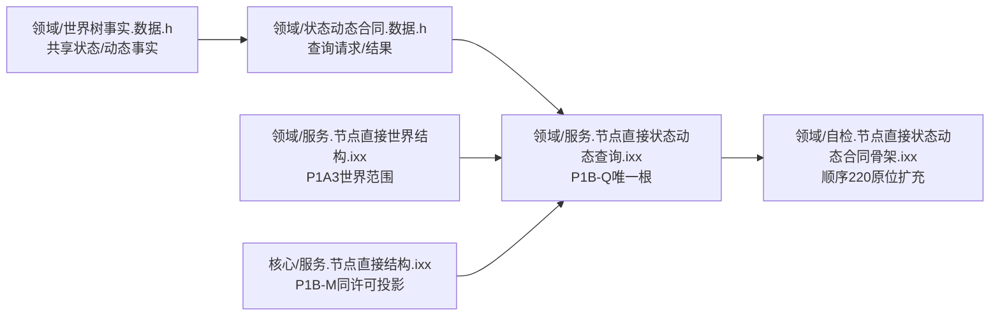
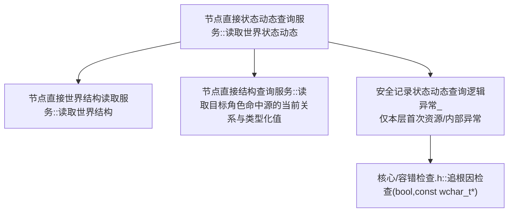
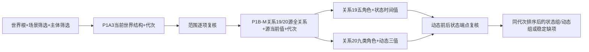
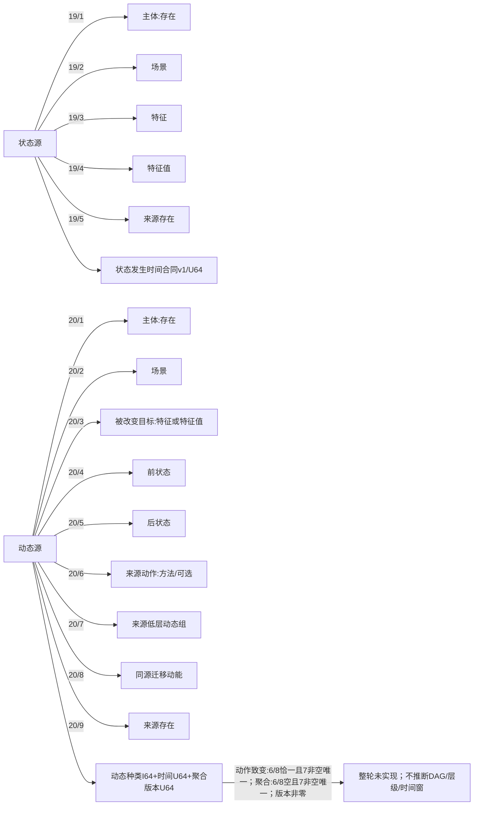

# WORLD-TREE-P1B-Q 真实状态动态查询函数结构知识图谱 v0.1

日期：2026-08-03

设计身份：WORLD-TREE-P1B-Q

## 1. 模块与所有权



P1B-Q 不修改 DTO、构造、成员或依赖方向，只替换 P1B-F 查询骨架函数体。

## 2. 唯一调用图



调用顺序固定为 W 后 M；场景组或主体组为空时 M 调用0，否则恰一次。禁止反向调用和循环。

## 3. 数据方向



## 4. 身份与角色图



## 5. 禁止边

```text
节点直接状态动态查询服务 -X-> 比较服务
节点直接状态动态查询服务 -X-> 提交服务/执行器/会话/仓库
节点直接状态动态查询服务 -X-> SQL/材料/缓存/时钟/旧世界栈
节点直接状态动态查询服务 --> 模块私有无抛诊断助手（仅本层首次资源/内部异常）
节点直接状态动态查询服务 -X-> P1B-W写项或P1C重试
```

## 6. 结果追踪

| 不变量 | 机器证明 |
| --- | --- |
| 根函数唯一 | 完整限定签名 AST 计数1 |
| 世界范围不复制 | `读取世界结构`调用边恰一次 |
| 同许可投影不拼接 | 两组非空时 P1B-M 调用边恰一次 |
| 单一事实截止 | 两结果代次非零且完全相等后才成功 |
| 角色完整 | 关系19/20逐源检查全部当前同类型关系 |
| 值证据完整 | 合同身份/版本、记录身份/版本、来源、发布代次逐字段保留 |
| 动态不悬空 | 前后状态只能引用本轮状态表 |
| 聚合不伪造 | 合法聚合动作/动态统一未实现；不返回部分事实，不诊断为错误 |
| 聚合基础形状 | 聚合动作角色6/8恰一；聚合动态角色6/8为空；两者角色7非空唯一且版本非零 |
| 零副作用 | 六仓、代次、幂等、持久侧账调用前后相等 |
| SQL非权威 | SQL及材料调用边为0 |
| 诊断物理闭合 | 仅模块私有助手调用 `核心/容错检查.h::追根因检查(bool,const wchar_t*)`；公开根不直调 |

## 7. 依赖和完成边界

P1B-F v0.2、P1B-M、P1A3 只有设计、骨架、WIP或消息时，本图谱是目标合同而非当前调用事实，S0 必须按具名依赖漂移零修改收口。本图不证明聚合DAG、状态动态写入、世界完整快照、生产装配或服务验收完成。
