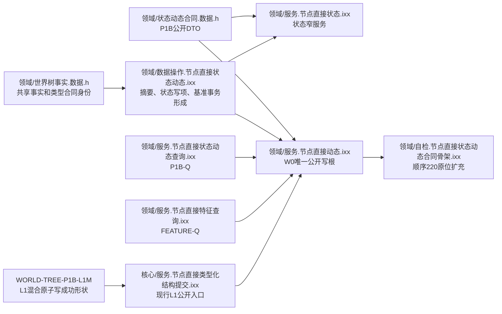
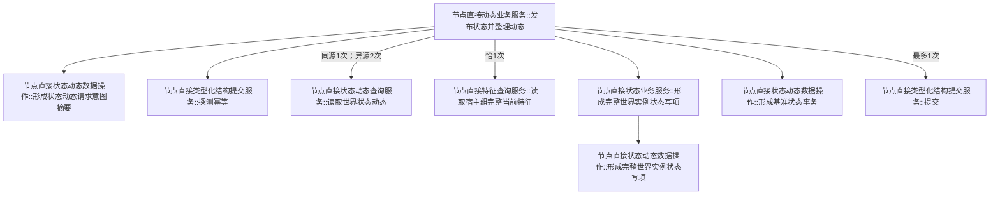
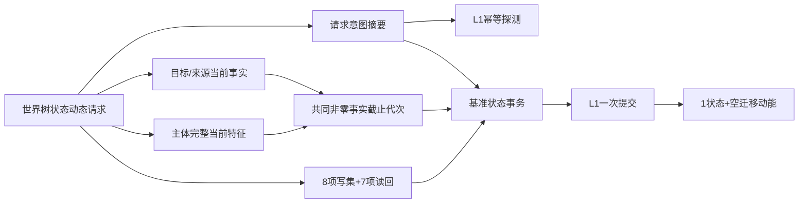
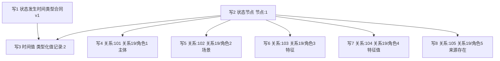

# WORLD-TREE-P1B-W0 首个基准状态原子发布函数结构知识图谱 v0.1

日期：2026-08-03

设计身份：WORLD-TREE-P1B-W0

代码基线：`ae777e65bdbde44a17af648d00745b6f37760318`

## 1. 身份和激活边界

本图谱描述 W0 目标函数及调用关系，不是当前代码调用事实。W0 是待激活消费者：`WORLD-TREE-P1B-L1M`“节点直接混合原子写集提供者”必须先把合同+节点+类型化值+关系的8项写集、7项读回在同一 L1 事务中的登记、读回、确认、逆序撤销和最后发布成功形状进入正式 main；空骨架不能解除门禁。

## 2. 模块所有权



W0 只修改状态动态数据操作、状态服务、动态服务和顺序220专项自检；不修改共享事实头、合同头、P1B-Q、FEATURE-Q、L1、工程、装配或启动。

## 3. 唯一函数调用图



调用顺序固定 A→P→Q→F→S→X→C。幂等终止时 P 后停止；已有前状态时 F 后停止。比较服务成员保持 ABI，但本叶调用边为0。

## 4. 数据与事务方向



只有 C 是机器事实写入边界。A、S、X 只形成调用方拥有的值式材料。

## 5. 8项写集与7项读回



读回固定为当前节点 `节点:1`、当前类型化值 `类型化值记录:2`、当前关系 `关系:101—105`，预期版本均为1。类型合同参与同一事务确认和最后发布，但不占这7项业务读回。

## 6. 结果与错误映射

| 来源 | 目标返回 |
| --- | --- |
| 幂等同义已发布且原7项读回完整 | 幂等读回 |
| 幂等异义 | 幂等冲突 |
| 幂等待发布/隔离或原结果矛盾 | 内部不一致 |
| 提供者代次不等、特征身份漂移、L1版本漂移 | 版本漂移 |
| 任一前状态存在 | 未实现14 |
| L1八状态 | 逐项同义映射 |
| 成功分类但7项读回矛盾 | 内部不一致，不补写 |

## 7. 禁止边

```text
发布状态并整理动态 -X-> 特征比较业务服务（本叶调用0）
发布状态并整理动态 -X-> 仓库/执行器/许可/锁/事务视图
状态服务/数据操作 -X-> L1提交
任一W0函数 -X-> SQL/材料/日志文本/缓存/时钟/旧状态动态栈
W0 -X-> 拆分为类型合同事务、节点关系事务、类型化值事务
```

## 8. 双向追踪矩阵

| 业务节点 | 根/函数 | 详细设计 |
| --- | --- | --- |
| B03/B04 | 摘要形成、探测幂等 | §5、§7 |
| B06/B08/B09 | P1B-Q、FEATURE-Q | §7 |
| B13 | 状态服务→状态写项数据操作 | §6 |
| B14 | 形成基准状态事务 | §8 |
| B15/B16 | L1提交、读回映射 | §9 |

## 9. 机器验证

AST/源码验证必须证明：两个公开根完整签名唯一；新增三个数据操作函数各定义一次；状态服务只委托一次；动态根比较调用0、FEATURE-Q恰1、P1B-Q同源1/异源2、L1提交最多1；无禁止边和循环；8/7数量、局部身份、关系角色及命名域 `0x5754534400000001` 与详细设计一致。

本图谱不证明依赖代码已实现或 W0 已可执行。
