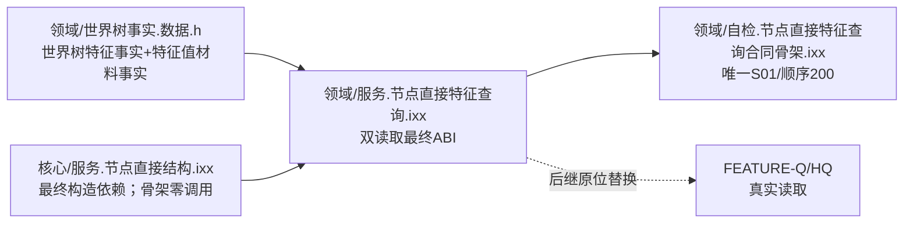
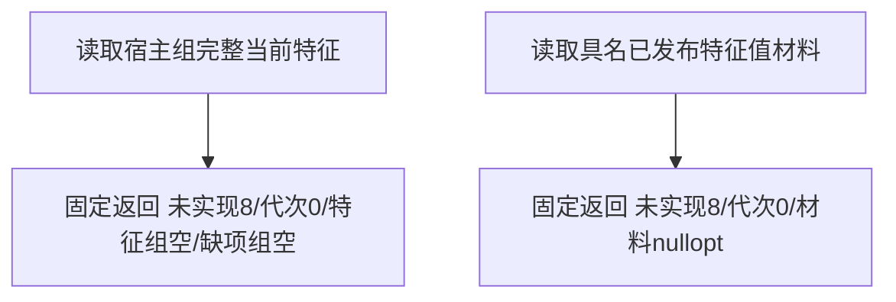
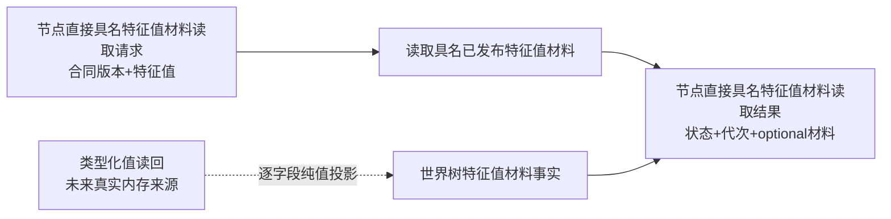

# WORLD-TREE-P1BF 特征双读取安全骨架函数结构知识图谱 v0.2

日期：2026-08-03

设计身份：WORLD-TREE-P1BF v0.4

## 1. 模块和所有权



共享头拥有跨服务纯值事实；特征查询模块拥有状态、请求、结果、服务类和两个公开函数；自检模块只拥有本合同专项验证。

## 2. 唯一函数图



两个根之间无调用边；对 `结构_`、L1/L2服务、仓库、SQL、材料、日志、缓存和时钟的调用边均为0。

## 3. DTO归属图



骨架阶段虚线投影不存在运行期调用，`材料` 固定 `nullopt`。后继 FEATURE-HQ 才可在一次内存许可内建立真实投影。

## 4. 提供者—消费者与替换关系

| 实体 | 提供者 | 骨架消费者 | 后继替换者 |
| --- | --- | --- | --- |
| 世界树特征事实 | P1BF共享头 | 宿主组结果/P1C | FEATURE-Q不改DTO |
| 世界树特征值材料事实 | P1BF共享头 | 具名结果/P1B比较等 | FEATURE-HQ不改DTO |
| 宿主组函数 | P1BF | 合法消费者只识别未实现 | FEATURE-Q原位替换 |
| 具名材料函数 | P1BF v0.4 | 合法消费者只识别未实现 | FEATURE-HQ原位替换 |
| S01/200 | P1BF | 顶层自检 | FEATURE-Q/HQ原位扩充同一身份 |

## 5. 禁止边与不变量

```text
两个公开根 -X-> 结构_
两个公开根 -X-> L1/L2 provider、仓库、执行器、会话、许可、锁、事务
两个公开根 -X-> SQL、材料、缓存、日志、时钟、旧特征栈
两个公开根 -X-> 参数字段读取、稳定身份分配、代次读取
P1BF v0.4 -X-> 第二服务类、第二模块、第二顺序200自检
```

| 不变量 | 机器证明 |
| --- | --- |
| 状态稳定 | 枚举1—8，未实现固定8 |
| 字段稳定 | 新事实10字段、请求2字段、结果3字段顺序逐项静态断言 |
| 固定返回 | 两完整函数源码闭包各仅含无抛断言和固定prvalue |
| 零调用 | 两函数 direct/member/callback/unresolved 均0 |
| 零副作用 | 调用前后权威导出和事实代次相等 |
| 自检唯一 | S01/顺序200恰一，总数20→21 |
| 后继门禁 | 骨架未实现不能满足 FEATURE-Q/HQ 真实成功依赖 |

## 6. 完成边界

本图是目标合同知识图谱，不是当前调用事实。P1BF v0.4 先冻结双读取 ABI；FEATURE-Q/HQ 后续只能原位替换对应函数体。骨架存在不证明任何真实特征材料可读，也不解除状态、比较、快照或服务验收门禁。
