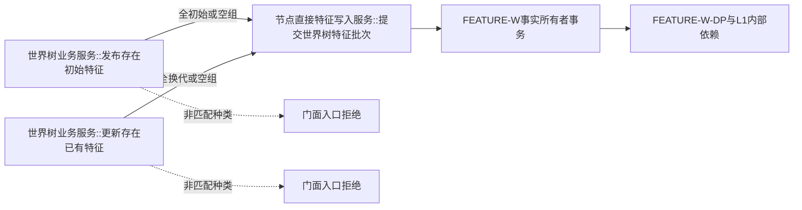

# WORLD-TREE-P1C-FW 特征两写真实门面替换函数结构知识图谱 v0.1

日期：2026-08-03

| 调用方 | 被调方 | 次数与条件 | 门面所有权 |
| --- | --- | --- | --- |
| 初始门面 | 特征批次提交 | 全部项目为初始或空组时恰1；否则0 | 只映射结果 |
| 更新门面 | 特征批次提交 | 全部项目为换代或空组时恰1；否则0 | 只映射结果 |
| 两根 | FEATURE-W-DP/L1/仓库/SQL/快照/日志/旧特征栈 | 0 | 禁止 |

聚合不变量：原公开签名、DTO所有者和五引用构造不变；两根定义各一；每根至多一条provider边；门面机器事实写边和日志边均0；provider原状态、代次、持久状态与匹配读回无损映射；provider内部不一致缺项组原样保留。FEATURE-W-DP是provider内部依赖，不形成门面直连边。

可达性分账：实线业务边须由真实 FEATURE-W 隔离仓运行验证；未知状态和坏成功形状属于门面防御源码闭包，不得用伪provider或测试 seam制造虚假运行边。
