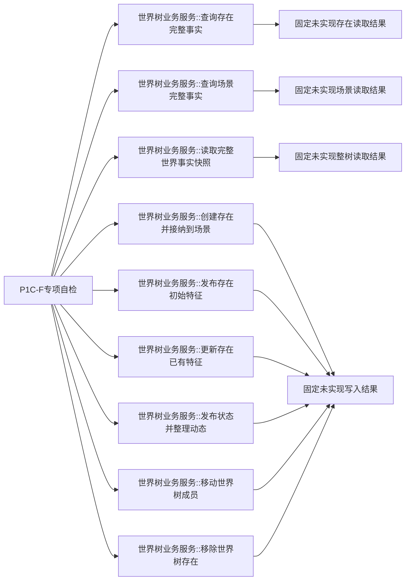
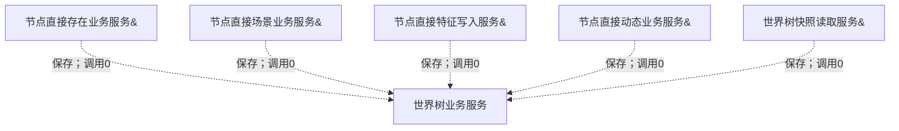

# WORLD-TREE-P1C-F 统一世界树业务服务最终合同骨架函数结构知识图谱 v0.1

日期：2026-08-03

## 1. 模块与九根

每根完整限定定义数为1、重载数为0。结果构造是本函数内指令，不是项目函数调用。

## 2. 生命周期依赖图

上述虚线均为构造与生命周期依赖，不计入九个骨架根的调用边。

## 3. 类型与边表

| 类型/函数 | 唯一所有者 | 骨架关系 |
| --- | --- | --- |
| 三读请求/结果、业务状态 | P1C-QF | import，不复制；返回固定未实现 |
| 世界树创建存在请求/写后事实/写入结果 | P1C-F | 本模块唯一声明 |
| 四类 provider 写请求/读回 | 各事实所有者 | import，不解释 |
| 专属自检 -> 九根 | P1C-F 自检 | 每根默认/非法/完整/边界调用 |
| 九根 -> 任意项目函数 | 无 | 0 |
| 生产消费者 -> 九根 | 后继 | 骨架阶段0；真实替换后另行接线 |

## 4. 聚合不变量

| 不变量 | 要求 |
| --- | --- |
| ABI | 九根完整签名、`noexcept`、DTO字段与variant顺序稳定 |
| 构造 | 五个非拥有引用，顺序固定，不可默认/复制/移动 |
| 参数/成员 | 九根参数不命名；参数引用0、成员读取0 |
| 调用 | 九根 direct/member/callback/unresolved 项目调用总数0 |
| 结果 | 三读未实现11/默认回执/空载荷；六写未实现11/0/不适用/空载荷 |
| 事实 | 节点、关系、索引、类型合同、类型化值、事务幂等六仓及事务域代次调用前后逐值相等 |
| 消费 | 未实现后成功后继调用0 |
| 自检 | `WORLD-TREE-P1C-F-S01`、顺序260唯一、N到N+1 |
