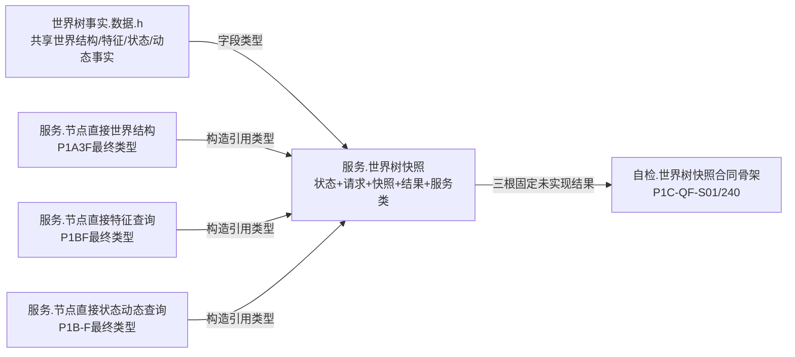
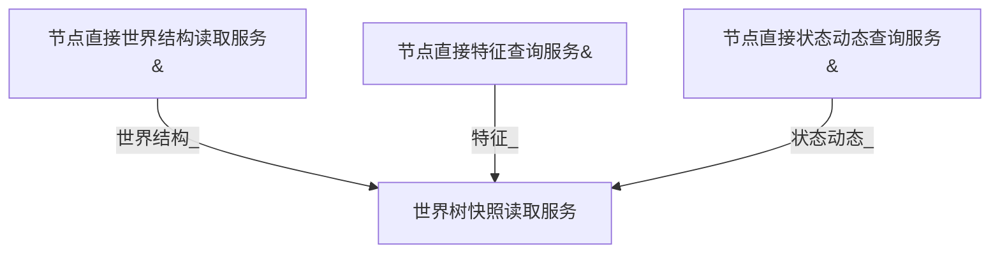
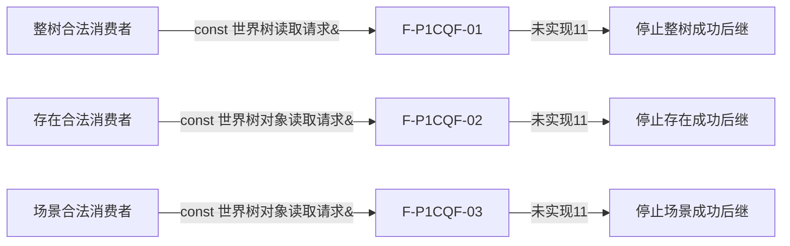

# WORLD-TREE-P1C-QF 完整快照读取最终合同骨架函数结构知识图谱 v0.1

日期：2026-08-03

设计身份：WORLD-TREE-P1C-QF

代码复核基线：`1cd635d9ac0eeab702bc1015d43416cd88f73863`

## 1. 图谱边界

本图谱冻结一个待新增模块、一个服务类、三个构造引用、三组专属 DTO 和三个根函数。实线 `引用` 只表示构造期保存非空引用；三根函数的项目内调用边均为0。

## 2. 模块、类型与唯一所有权

| 身份 | 唯一声明位置 | 允许消费者 |
| --- | --- | --- |
| `世界树业务状态` | `领域/服务.世界树快照.ixx` | P1C-Q、后继P1C-W和合法上层消费者 |
| `世界树读取请求`、`世界树对象读取请求` | 同上 | 三读取根和合法消费者 |
| 三类快照、三类读取结果 | 同上 | P1C-Q和合法消费者 |
| `世界树快照读取服务` | 同上 | 后继世界树门面、运行期只读组合器、自检 |
| 世界结构/特征/状态动态事实 | `世界树事实.数据.h` | P1C-QF只按字段类型使用，不重复声明 |

## 3. 构造依赖与生命周期

装配宿主拥有 A/B/C 和 Q，A/B/C 长于 Q 及其全部同步调用。构造参数、初始化列表和成员顺序固定 A→B→C。构造只绑定引用；没有 provider 调用、读取、分配、恢复或事实变化。

## 4. 根函数身份与调用边

| ID | 完整签名 | 直接/成员/回调/未解析调用 | 固定结果 | 施工图 |
| --- | --- | --- | --- | --- |
| F-P1CQF-01 | `世界树读取结果 世界树快照读取服务::读取完整世界事实快照(const 世界树读取请求& 请求) const noexcept` | 0/0/0/0 | 未实现11、默认头、空快照/缺项 | `流程图/20260803_世界树快照读取服务读取完整世界事实快照_函数流程图_v0.2.md` |
| F-P1CQF-02 | `世界树存在读取结果 世界树快照读取服务::读取存在完整事实(const 世界树对象读取请求& 请求) const noexcept` | 0/0/0/0 | 未实现11、默认对象请求、空快照/缺项 | `流程图/20260803_世界树快照读取服务读取存在完整事实_函数流程图_v0.2.md` |
| F-P1CQF-03 | `世界树场景读取结果 世界树快照读取服务::读取场景完整事实(const 世界树对象读取请求& 请求) const noexcept` | 0/0/0/0 | 未实现11、默认对象请求、空快照/缺项 | `流程图/20260803_世界树快照读取服务读取场景完整事实_函数流程图_v0.2.md` |

F2/F3 不调用 F1。骨架阶段不存在三根之间的调用边，也不存在 Q→A/B/C 的运行期调用边。

## 5. 数据、版本和事务闭合

| 维度 | 固定合同 | 禁止解释 |
| --- | --- | --- |
| 服务状态 | `未实现=11` | 已读取、未找到、入口拒绝、资源失败 |
| 请求回执 | 默认空请求 | 已验证输入、世界根事实 |
| 快照/缺项 | 空 | 合法空世界、部分成功、诊断成功 |
| 事实截止代次 | 不存在/0 | 当前代次、时钟、运行期纪元 |
| provider调用 | 全部0 | 探测能力、空读取、回退 |
| 事务/许可/SQL | 不取得 | 空事务成功、SQL回源 |
| 自检版本 | `P1C-QF-S01` / 顺序240 / S0 N→N+1 | FEATURE-W依赖、第二240槽位 |

## 6. 验证追踪

| 不变量 | 机械证据 |
| --- | --- |
| 三根身份各唯一 | Clang AST/文本扫描每个完整签名恰1 |
| 三根调用边为0 | AST直接、成员、回调和未解析调用均0 |
| 参数零读取 | AST参数引用计数0；函数定义参数无名称 |
| 固定结果无抛 | 三个固定prvalue `static_assert(noexcept(...))` |
| 构造依赖完整 | 编译期三引用正例；默认/缺参/指针反例 |
| 零机器事实 | 调用前后节点、关系、索引、类型合同、类型化值五仓权威导出和事务域事实截止代次逐值相等 |
| 消费者安全停止 | 未实现11后的成功后继调用数0 |

## 7. 后继边界

P1C-Q 只在 F-P1CQF-01—03 原位替换函数体并扩充同一 S01 自检；不得新建平行模块、DTO、结果状态、重载或第二服务。P1C-QF 不证明任何真实查询调用边已成立。
