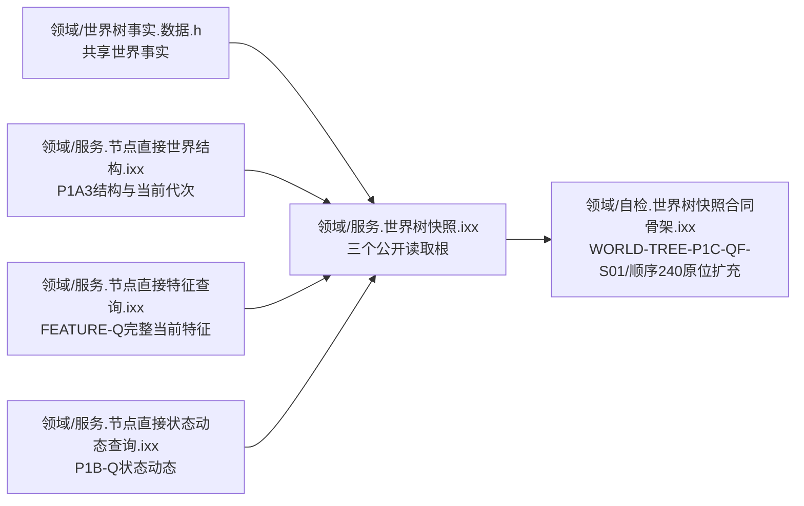
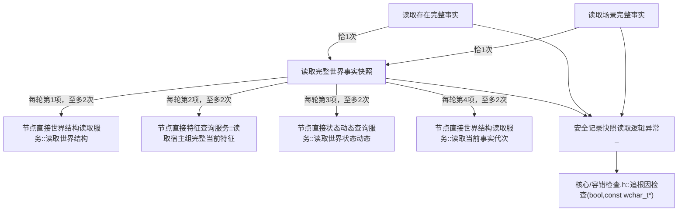
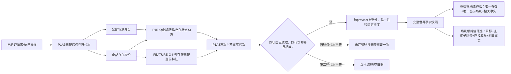
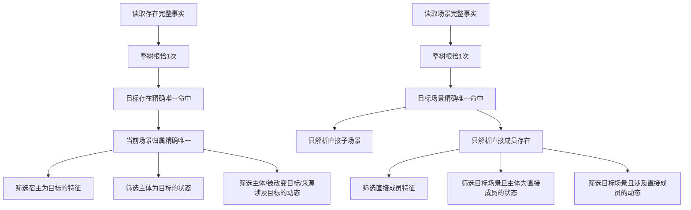

# WORLD-TREE-P1C-Q 同代次完整快照真实读取函数结构知识图谱 v0.1

日期：2026-08-03

设计身份：WORLD-TREE-P1C-Q

## 1. 模块、身份与物理所有权



本叶只在 P1C-QF 的最终模块、DTO、服务类、构造和自检身份内原位实现真实读取。禁止新增公开模块、DTO、重载、构造参数、服务或第二个顺序240自检项。

三个唯一公开根为：

```cpp
世界树读取结果 世界树快照读取服务::读取完整世界事实快照(
    const 世界树读取请求& 请求) const noexcept;

世界树存在读取结果 世界树快照读取服务::读取存在完整事实(
    const 世界树对象读取请求& 请求) const noexcept;

世界树场景读取结果 世界树快照读取服务::读取场景完整事实(
    const 世界树对象读取请求& 请求) const noexcept;
```

## 2. 唯一调用图与调用顺序



整树根每轮调用顺序固定为 `读取世界结构 -> 读取宿主组完整当前特征 -> 读取世界状态动态 -> 读取当前事实代次`。只有四项均成功、代次均非零但不全相等时，才丢弃整轮并完整重读一次。对象根各调用整树根恰一次，之后只做值式筛选，直接 provider 调用数为0。

## 3. 数据和控制方向



任何 provider 非成功立即同名映射且不重试；`已读取` 携带零代次、成功缺项或自相矛盾材料立即映射本层 `内部不一致`。禁止从第一轮向第二轮继承容器、缺项、排序状态或快照临时值。

## 4. 提供者—消费者图

| 提供者 | 本叶消费合同 | 调用者 | 成功使用条件 |
| --- | --- | --- | --- |
| P1C-QF | 最终模块、DTO、构造、三根、顺序240自检身份 | P1C-Q原位实现 | 正式代码中真实存在且写权释放 |
| P1A3 | `读取世界结构`、`读取当前事实代次` | 整树根 | 状态已读取、代次非零、根与身份组一致 |
| FEATURE-Q | `读取宿主组完整当前特征` | 整树根 | 全部存在范围完整、代次非零、缺项空 |
| P1B-Q | `读取世界状态动态` | 整树根 | 全场景/存在范围完整、代次非零、缺项空 |
| P1B-W | 不直接消费 | 无 | 仅后继非空服务验收数据前置 |
| P1C-WF/W | 消费本叶三类读取结果 | 后继统一门面 | 本叶真实结果进入正式代码后 |

## 5. 对象筛选边界



场景根不得递归后代场景成员。对象无相同稳定主键返回未找到；同稳定主键但类型或身份版本不同返回版本漂移；多解、同身份异内容或归属矛盾返回内部不一致。

## 6. 禁止边

```text
世界树快照读取服务 -X-> SQL/ODBC/持久材料/缓存/界面投影
世界树快照读取服务 -X-> 旧世界服务/旧特征栈/旧状态动态栈
世界树快照读取服务 -X-> 仓库/执行器/会话/提交/比较/写服务
世界树快照读取服务 -X-> 跨provider许可、事务、sleep、循环try-lock、时钟
读取存在完整事实 -X-> 世界结构/特征/状态动态provider
读取场景完整事实 -X-> 世界结构/特征/状态动态provider
三个公开根 -X-> 直接调用追根因检查
```

唯一诊断边为 `三个公开根 -> 模块私有无抛助手 -> 追根因检查(bool,const wchar_t*)`。下层已经诊断的非成功不得重复记录，诊断不得改变机器状态或返回值。

## 7. 结果和不变量追踪

| 不变量 | 机器证明 |
| --- | --- |
| 三根身份唯一 | 三个完整限定签名各唯一源码定义 |
| 权威来源唯一 | 只消费 P1A3、FEATURE-Q、P1B-Q 当前内存发布结果 |
| 固定调用顺序 | 整树根每轮四条直接边按1—4出现；每条至多2次 |
| 重试边界 | 只有四项成功、四代次非零但不等可进入第二轮 |
| 单一事实截止 | 四个非零代次完全相等后才形成快照 |
| 无部分成功 | 任一非成功、缺项或矛盾均返回空快照 |
| 对象根零直连 | 各恰调用整树根1次，provider直接边0 |
| 场景范围非递归 | 只保留目标、直接子场景、直接成员及其相关事实 |
| 请求回执安全 | 准入前默认，准入后回显已验证请求 |
| 稳定输出 | 全部组按稳定主键、身份版本及冻结复合键排序 |
| 零事实变化 | 权威仓、幂等账、持久侧账和事实代次调用前后相等 |
| 自检身份不增 | 仍为 `WORLD-TREE-P1C-QF-S01` / 顺序240；总数N保持N |

## 8. 完成边界

本图谱冻结 P1C-Q 的目标调用结构，不表示当前正式代码已经具备成功读取路径。只有 P1C-QF、P1A3、FEATURE-Q、P1B-Q 的真实结果均进入正式代码且写权释放后才能施工。本叶完成也不证明统一写门面、P1B-W、运行期装配、旧入口删除、SQL应急、生产消费者或端到端服务验收完成。
