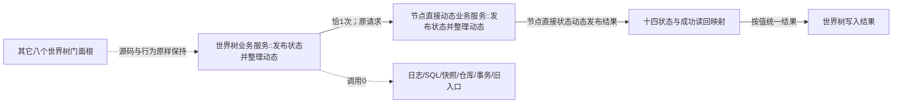

# WORLD-TREE-P1C-SDW 状态动态一写真实门面替换函数结构知识图谱 v0.1

日期：2026-08-03

设计身份：WORLD-TREE-P1C-SDW

代码复核基线：`0371103724e2d6cb7eda79a6060be15d7d22ef54`

## 1. 图谱边界

本图只冻结 P1C 门面一个根到 P1B 动态事实所有者的一条公开调用边，以及结果映射、保持边和禁止边。provider 内部查询、比较、状态写项与 L1 事务闭包不在门面展开。

## 2. 函数与调用图

## 3. 身份表

| ID | 身份 | 物理位置 | 本叶 |
| --- | --- | --- | --- |
| F-P1C-SDW-01 | `世界树写入结果 世界树业务服务::发布状态并整理动态(const 世界树状态动态请求&) const noexcept` | `海中鱼巣/领域/服务.世界树.ixx` | 原位替换骨架函数体 |
| F-P1B-SDW-01 | `节点直接状态动态发布结果 节点直接动态业务服务::发布状态并整理动态(const 世界树状态动态请求&) const noexcept` | `海中鱼巣/领域/服务.节点直接动态.ixx` | 只调用，不修改 |
| T-P1C-SDW-01 | `世界树写入结果` | P1C-F最终模块 | 不改字段/顺序 |
| T-P1B-SDW-01 | `节点直接状态动态发布结果` | P1B-F合同头 | 不复制、不修改 |

## 4. 调用与禁止矩阵

| 调用方 | 被调函数/对象 | 次数 | 允许条件 |
| --- | --- | ---: | --- |
| F-P1C-SDW-01 | F-P1B-SDW-01 | 1 | 任意请求均原样委托 |
| F-P1C-SDW-01 | `存在_ / 场景_ / 特征_ / 快照_` | 0 | 永久禁止本叶调用 |
| F-P1C-SDW-01 | 查询、比较、状态、数据操作、L1提交 | 0 | 只能由P1B provider内部拥有 |
| F-P1C-SDW-01 | 日志、SQL、材料、缓存、时钟、仓库、许可、事务、旧世界入口 | 0 | 禁止 |

## 5. 结果边

| provider分类 | 门面状态 | 业务载荷 | 缺项 |
| --- | --- | --- | --- |
| 已提交/幂等读回且读回匹配 | 同名 | 目标=后状态；关系空；操作读回=原读回 | 空 |
| 入口拒绝/幂等冲突/版本漂移/许可拒绝/资源失败/未实现 | 对应同名 | 空 | 空 |
| 比较未注册 | 资源失败 | 空 | 空 |
| 不可比/差异不可表示/历史插入拒绝 | 入口拒绝 | 空 | 空 |
| 前状态不唯一/未知值/成功读回矛盾 | 内部不一致 | 空 | 空 |
| provider内部不一致 | 内部不一致 | 空 | 原provider缺项 |

所有边保留 provider 代次和持久状态。门面不产生第二机器事实写入。

## 6. 所有权、生命周期与保持边

`状态动态_` 引用由 P1C-F 装配宿主持有并长于门面；P1B内部六依赖由 P1B 装配拥有。请求只读借用，两个结果均按值返回。门面不保存请求、provider结果或读回。

其它八根、五引用构造、DTO、静态断言、模块 import、P1C-F-S01 顶层身份和已存在专项矩阵为保持边。S0 和完成验证必须逐根/逐项证明未被本叶修改。

## 7. 验证追踪

| 验证 | 方法 |
| --- | --- |
| 可达真实行为 | 隔离仓+正式P1B provider运行首状态、幂等、拒绝和未实现路径 |
| 不可达防御 | AST/等价源码闭包覆盖十四状态、未知值、E02—E04和日志0 |
| 调用边 | provider恰1；其它成员/事务/日志/旧入口0 |
| 原子/幂等 | 只接受provider原结果；失败不补写、不重试、不快照回证 |
| 读回 | 入口匹配后状态与可选迁移动能；矛盾清空载荷 |
| 保持 | 其它八根和P1C-F-S01既有内容前后相等 |

## 8. 后继与退出边界

P1B 后继可在原 provider ABI 内实现等价状态和迁移动能；只要公开结果合同不变，本门面无需新增第二入口。旧六写图和旧 P1C 大包由原所有者在三个新版写叶正式登记后退役，本叶不取得其文件所有权。
