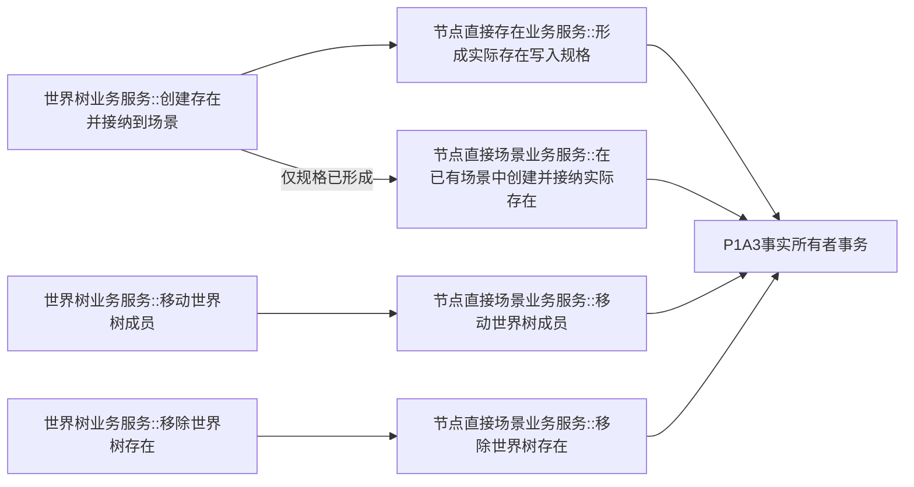

# WORLD-TREE-P1C-SW 结构三写真实门面替换函数结构知识图谱 v0.1

日期：2026-08-03

| 调用方 | 被调方 | 次数与条件 | 门面所有权 |
| --- | --- | --- | --- |
| 创建门面 | 存在规格 | 恰1 | 只读结果 |
| 创建门面 | 场景创建 | 规格已形成且存在时恰1，否则0 | 映射专属读回 |
| 移动门面 | 场景移动 | 恰1 | 映射专属读回 |
| 移除门面 | 场景移除 | 恰1 | 映射专属读回 |
| 三根 | 日志/仓库/L1/SQL/快照/旧世界服务 | 0 | 禁止；最终日志责任归P1D正式入口 |

聚合不变量：原公开签名、DTO所有者和五引用构造不变；三根定义仍各一；创建最多两条provider边，移动/移除各一；其它六根调用边仍0；门面没有机器事实写边或日志边；provider 原事务发布代次与持久状态无损映射，provider `内部不一致` 的缺项组原样保留。
