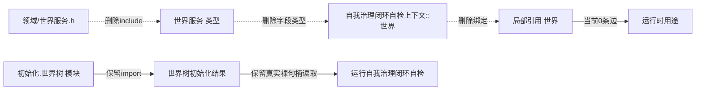

# WORLD-TREE-P1D-MIG-SELF-CLOSURE-WORLD-REF 自我治理闭环自检旧世界服务引用退出函数结构知识图谱 v0.1

日期：2026-08-03

设计身份：WORLD-TREE-P1D-MIG-SELF-CLOSURE-WORLD-REF

代码复核基线：`b8dd29cdcda86fb88c0bee4a91467f5d637f817c`

## 1. 图谱边界

本图只描述待删除的旧世界服务直接依赖链，以及必须保持的旧初始化读数链。删除边为编译/引用边，不是业务调用边。

## 2. 删除链与保留链

## 3. 身份和调用点

| ID | 身份 | 当前外部构造/调用 | 本叶 |
| --- | --- | --- | --- |
| T-P1D-SELF-01 | `自我治理闭环自检上下文` | 0 | 删除 `世界服务& 世界` 字段 |
| F-P1D-SELF-01 | `自我治理闭环自检报告 运行自我治理闭环自检(const 自我治理闭环自检上下文& 上下文)` | 0 | 删除未使用局部别名 |

## 4. 边变化表

| 调用方/载体 | 被依赖项 | 边类型 | 目标 |
| --- | --- | --- | --- |
| 模块全局片段 | `世界服务.h` | 文本包含 | 删除 |
| 自检上下文 | `世界服务` | 类型/生命周期借用 | 删除 |
| 根函数 | `上下文.世界` | 引用绑定 | 删除 |
| 根函数 | `世界树初始化读数` | 字段读取 | 保留全部 |
| 根函数 | 四组专项服务 | 运行时调用 | 保持当前 |

## 5. 所有权和生命周期

世界服务由外部装配拥有，当前上下文只借用；删除引用不销毁、不停止也不修改服务。上下文无当前构造消费者，因此不存在引用重绑。世界树初始化读数仍由外部初始化路径拥有，根函数只在调用期间借用。

## 6. 验证追踪

| 不变量 | 证据 |
| --- | --- |
| 删除链完整 | include、字段、别名三点零命中 |
| 无漏改调用者 | 全仓类型和根函数只有定义命中 |
| 运行时边不变 | scoped结构比较与构建/自检 |
| 保留真实旧读数 | 初始化结果字段及其读取点数量/位置不变 |
| 无兼容壳 | 新增代码行0、文件0、类型0、函数0 |
| 旧头仍存在 | 文件和工程登记不在允许范围 |

## 7. 后继

后继必须为 `世界树初始化结果` 的稳定身份迁移单独冻结提供者和字段来源；不得把本叶的直接服务引用退出解释为该结果已迁移。
