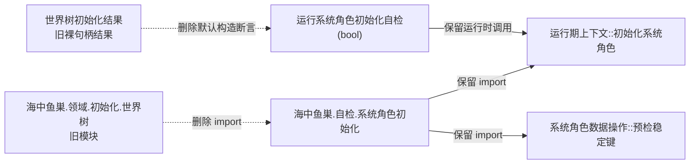
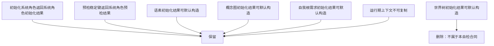

# WORLD-TREE-P1D-MIG-SYSROLE-TEST 系统角色自检旧世界类型退出函数结构知识图谱 v0.1

日期：2026-08-03

设计身份：WORLD-TREE-P1D-MIG-SYSROLE-TEST

代码复核基线：`b8404079aaed5b6012fbe459526f5491fb8921af`

## 1. 图谱边界

本图只冻结一个现有自检模块的一条待删除模块依赖和一条待删除类型引用。所有运行时节点、调用边、事实所有权和返回边保持当前代码。

## 2. 迁移前后依赖图

迁移后 WT→ST 和 WR→RF 两条边均不存在；不存在替代旧边。RC/DR及其它既有初始化、自检运行器依赖保持。

## 3. 函数身份和变化矩阵

| 身份 | 完整签名 | 变化 | 禁止变化 |
| --- | --- | --- | --- |
| F-P1D-SYSROLE-01 | `自检单元结果 运行系统角色初始化自检(bool 历史兼容回归通过)` | 删除函数入口区一条旧结果默认构造断言 | 签名、参数引用、22项矩阵、调用边、返回身份和异常路径 |

## 4. 编译期合同图

## 5. 所有权和调用边

| 对象 | 唯一所有者 | 本叶处理 |
| --- | --- | --- |
| `世界树初始化结果` | `海中鱼巣.领域.初始化.世界树` | 停止消费；不迁移、不复制、不别名 |
| `系统角色初始化结果` | 现行系统角色初始化模块 | 保持消费 |
| `运行期上下文` | `海中鱼巣.启动.运行期上下文` | 保持隔离自检调用 |
| 22项验收数组 | 根函数局部 | 保持数量、索引和汇总 |

运行时调用边增量为0、删除为0；只有编译期依赖边删除2条。目标模块不获得世界树门面、快照、旧世界服务、仓库、SQL或材料调用边。

## 6. 验证追踪

| 不变量 | 机械证据 |
| --- | --- |
| 旧依赖退出 | 目标文件四组旧词零命中 |
| 变更精确 | scoped diff只删除两处 |
| 模块边退出 | MSVC模块依赖扫描无ST→WT边 |
| 运行时不变 | 函数签名、22项、自检身份和调用结构静态比对 |
| 无兼容壳 | 无新增文件、类型、函数、别名、重载或转发 |
| 旧头保留 | 删除文件数0，全仓其余旧消费者数量不在本叶宣称减少 |

## 7. 后继边界

本叶之后，P1D仍必须分别迁移旧世界提供/装配、语素、需求、自我、显示和历史专项自检。只有全部消费者退出且新门面真实行为进入正式代码，最终原子切换叶才可删除 `海中鱼巣/领域/世界服务.h`。
