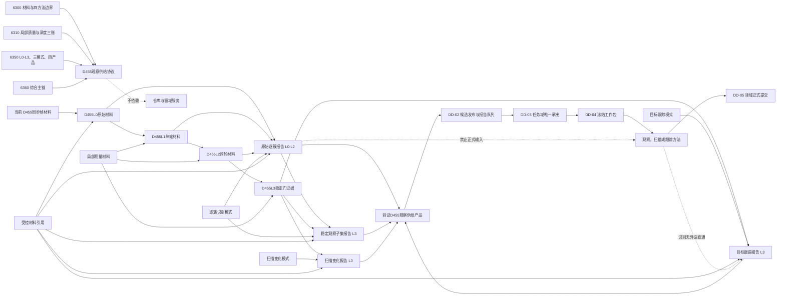

# DD-01 D455 材料成熟度与四类产品函数结构清单与知识图谱

日期：2026-07-21

角色：设计窗口

状态：DD-01 函数、结构和依赖图已形成；#324 / DQ-216 已登记为依赖门控待执行；代码未实现

## 1. 依据与边界

依据：

- `规范/详细设计/D455材料成熟度与四类产品数据合同详细设计.md`
- `流程图/20260721_DD01_D455材料成熟度与四类产品数据合同流程图_v0.1.md`
- `计划/20260721_DD01_D455材料成熟度与四类产品数据合同代码实施切片_v0.1.md`
- 6300、6310、6350、6360 正式规范
- 当前 `协议.D455采样材料`、`缓存.D455帧材料` 和 `上行桥.D455采样材料` 代码事实

本记录把流程节点拆成结构、函数、生产者、消费者和验证边。它不是代码许可；函数名称是后继设计和施工计划的唯一候选接口，执行前仍须复核实际模块和签名。

范围一致性结论：正式规范、详细设计、流程图、本文的函数 / 结构清单与知识图谱、#324 施工计划五者共同限定为“D455 成熟度、三模式、四类产品、来源 / 范围 / 时间 / 局部质量、L3 门和纯值合同”；均排除生产算法、报告队列、任务域消费、方法输入和生产入口接线。#324 因 DD-02 尚未完成材料域身份与发布接口复核而保持依赖门控，当前不得派发。

## 2. 结构清单

### 2.1 当前复用结构

| 结构 | 当前所有者 | DD-01 用途 | 写入方 | 读取方 | 生命周期 |
| --- | --- | --- | --- | --- | --- |
| `D455设备身份材料` | `适配.协议.D455采样材料` | 产品头来源外设材料 | D455 采集器 | 产品形成器、合同验证器 | 采集器打开至产品来源失效 |
| `D455同步帧材料` | `适配.协议.D455采样材料` | L0 原始同步帧来源 | D455 采集器 / 模拟来源 | L0 形成器、原始缓存 | 当前缓存引用期 |
| `D455相机内参材料` | `适配.协议.D455采样材料` | L0 坐标和点云派生来源 | D455 采集器 | L0 形成器、质量验证 | 随来源帧和标定版本 |
| `D455相机外参材料` | `适配.协议.D455采样材料` | 对齐、坐标转换和来源回查 | D455 采集器 | L0 形成器、质量验证 | 随来源帧和标定版本 |

当前 `D455帧材料句柄` 只属于原始缓存内部引用，不能直接充当跨产品受控引用；DD-02 必须给出材料域解析和适配方式。

### 2.2 DD-01 新增公共结构

| 结构 | 唯一所有者 | 用途 | 写入方 | 读取方 | 生命周期 / 失效 |
| --- | --- | --- | --- | --- | --- |
| `D455材料成熟度` | `适配.协议.D455观察供给` | L0—L3 最高成熟层 | 产品形成器 | 合同验证器、DD-02 队列、DD-03 任务域 | 随不可变产品内容 |
| `D455观察运行模式` | 同上 | 三种外显模式 | 等待项适配器 / 产品形成器回显 | 产品验证、任务域匹配 | 随等待项和产品 |
| `D455逻辑供给产品类型` | 同上 | 四类产品身份 | 产品形成器 | 队列分类、任务域、合同验证 | 随不可变产品内容 |
| `D455合同结果分类` | 同上 | 有效 / 逻辑内拒绝 / 内部逻辑错误 | 纯值验证入口 | 调用方 | 单次验证调用 |
| `D455供给产品身份` | 同上 | 定位外设产品，不定位世界存在 | DD-02 生产者身份分配器 | 队列、任务域、来源回查 | 生产者世代内唯一；过期或撤销后失效 |
| `D455受控材料引用` | 同上 | 引用帧、点云、掩码、局部图、关联和基准材料 | 材料域发布者 | 产品形成器、队列、任务域 | 材料域和版本当前时有效 |
| `D455等待项引用` | 同上 | 回显外设等待项 | 外设控制域等待项适配器 | 产品形成器、任务域匹配 | 等待项有效窗口 |
| `D455目标约束引用` | 同上 | 回显扫描 / 跟踪目标约束 | 等待项适配器 | 产品形成器、任务域匹配 | 约束版本有效窗口 |
| `D455观察范围材料` | 同上 | ROI、坐标系、掩码和目标范围 | 等待项适配器 / 产品形成器 | 质量门、任务域、方法材料适配 | 产品有效窗口 |
| `D455材料时间窗口` | 同上 | 来源时间、形成时间和最大年龄 | 产品形成器 | 合同验证、队列过期、任务域时效 | 产品有效窗口 |
| `D455点云材料说明` | 同上 | 点云引用、单位、坐标系、有效掩码和点数 | L0 形成器 | 质量门、后续空间材料处理 | 来源材料有效窗口 |
| `D455局部质量等级` | 同上 | 稳定、降级、不稳定、不可得 | 质量评估器 | L3 门、产品验证、任务域 | 随质量规则版本 |
| `D455局部质量材料` | 同上 | 局部对象和特征级质量证据 | 质量评估器 | L3 门、产品负载、任务域 | 随来源和规则版本 |
| `D455L0原始材料` | 同上 | 原始帧、点云、掩码、单位、坐标和来源链 | L0 形成器 | L1 形成器、原始产品形成器 | 来源材料有效窗口 |
| `D455L1单轮材料` | 同上 | 单轮簇、掩码、局部图、轮廓和质量 | L1 形成器 | 原始产品、L2 形成器 | 单轮及短期回查窗口 |
| `D455L2跨轮材料` | 同上 | 跨轮关联、连续命中、离散度和稳定候选 | L2 形成器 | 原始产品、L3 门 | 跨轮窗口 |
| `D455L3稳定门证据` | 同上 | 稳定可交付的完整门证据 | L3 评估器 | 三类 L3 产品形成器、合同验证器 | 随输入和规则版本 |
| `D455观察供给产品头` | 同上 | 产品公共身份、来源、范围、时间和质量版本 | 产品形成器 | 产品总验证、DD-02 队列 | 随不可变产品 |

### 2.3 四类负载结构

| 结构 | 唯一写入方 | 只读方 | 特有不变量 |
| --- | --- | --- | --- |
| `D455原始逐簇报告` | 原始逐簇产品形成器 | 任务域质量门、外设诊断视图 | 模式=逐簇识别；成熟度仅 L0—L2；不得成为方法正式输入 |
| `D455稳定观察子集报告` | 稳定观察产品形成器 | DD-03 任务域；DD-04 观察材料适配 | 模式=逐簇识别；成熟度=L3；只引用来源原始产品，不复制原始负载 |
| `D455扫描变化报告` | 扫描变化产品形成器 | DD-03 任务域；DD-04 扫描材料适配 | 模式=扫描变化；成熟度=L3；必须有可比基准和覆盖范围 |
| `D455目标跟踪报告` | 目标跟踪产品形成器 | DD-03 任务域；DD-04 跟踪材料适配 | 模式=目标跟踪；成熟度=L3；必须有目标约束和观察窗口；丢失可无坐标 |
| `D455观察供给产品` | 四类产品形成器 | 产品总验证、DD-02 队列 | 产品类型与 `variant` 负载唯一一致 |
| `D455合同验证结果` | 纯值验证入口 | 产品形成器、DD-02 候选发布器、自检 | 不修复输入；内部逻辑错误和逻辑内拒绝分开 |

## 3. 函数清单

### 3.1 DD-01 合同模块应实现的纯值函数

| 函数候选 | 输入 | 输出 | 前置拒绝 | 内部逻辑错误边界 | 对应流程节点 |
| --- | --- | --- | --- | --- | --- |
| `验证D455受控材料引用` | 单个引用 | 合同验证结果 | 零域、零编号、零版本、未知种类 | 已发布引用读回字段自相矛盾由 DD-02 分类 | C、W |
| `验证D455观察范围` | 范围材料 | 合同验证结果 | 零面积、未知坐标系、掩码尺寸不符 | 候选准备后读回范围变化 | B、W |
| `验证D455时间窗口` | 时间窗口、当前时间 | 合同验证结果 | 时间倒置、过期、零最大年龄 | 已发布产品同身份时间字段变化 | B、W |
| `验证D455局部质量材料` | 局部质量 | 合同验证结果 | 未知等级、缺来源、不可得却填默认值 | 已声明稳定但量化证据或规则版本缺失 | F、H、J、W |
| `验证D455L0原始材料` | L0 材料 | 合同验证结果 | 原始帧、点云、单位、掩码、坐标或来源缺失 | 同一来源读回布局、摘要或标定矛盾 | C、W |
| `验证D455L1单轮材料` | L1 材料 | 合同验证结果 | 缺 L0、簇引用非法、单轮质量不完整 | 声明 L1 后来源链或簇材料丢失 | F、W |
| `验证D455L2跨轮材料` | L2 材料 | 合同验证结果 | 缺 L1、轮次不足、关联和离散度材料缺失 | 声明跨轮完成但参与材料重复或来源自循环 | H、W |
| `验证D455L3稳定门证据` | L3 证据 | 合同验证结果 | 任一门未通过或证据不足 | 已声明门通过但缺输入、阈值来源或规则版本 | J、L、W |
| `验证D455原始逐簇报告` | 原始报告 | 合同验证结果 | 模式、成熟度、来源、负载不合法 | 类型字段与负载内容矛盾 | G、I、K、W |
| `验证D455稳定观察子集报告` | 稳定报告 | 合同验证结果 | 非 L3、缺来源原始产品、复制原始负载 | 已声明 L3 但证据或来源读回不一致 | M、W |
| `验证D455扫描变化报告` | 扫描报告 | 合同验证结果 | 缺基准、缺覆盖、非 L3 | 同一基准版本出现相反身份或来源 | N、P、W |
| `验证D455目标跟踪报告` | 跟踪报告 | 合同验证结果 | 缺目标或窗口、非 L3、状态和值不匹配 | 复现状态无坐标或丢失状态伪造坐标 | Q、T、U、V、W |
| `验证D455观察供给产品` | 总产品 | 合同验证结果 | 未知类型、组合矩阵不合法、`variant` 不匹配 | 候选准备后同身份读回不同内容 | W、X、Z |

### 3.2 后继生产者函数候选

这些函数由 DD-02 的生产者设计最终定模块和签名，DD-01 不实施：

| 函数候选 | 直接职责 | 产物 | 当前所属阶段 |
| --- | --- | --- | --- |
| `形成D455L0原始材料` | 从同步帧、深度和点云来源形成 L0 值 | `D455L0原始材料` | DD-02 前置接口假定 |
| `形成D455L1单轮材料` | 校正、对齐、滤波、分割并形成簇和局部质量 | `D455L1单轮材料` | DD-02 生产算法适配 |
| `形成D455L2跨轮材料` | 关联轮次、统计命中和离散度 | `D455L2跨轮材料` | DD-02 生产算法适配 |
| `评估D455L3稳定门` | 对来源、范围、时效、深度、对齐、跨轮和局部质量逐项裁决 | `D455L3稳定门证据` 或逻辑内未通过原因 | DD-02 生产算法适配 |
| `形成D455原始逐簇产品` | 形成 L0—L2 原始 / 中间供给 | 原始逐簇报告 | DD-02 |
| `形成D455稳定观察子集产品` | 引用原始产品并选择通过 L3 门的簇 | 稳定观察子集报告 | DD-02 |
| `形成D455扫描变化产品` | 在 L3、基准和覆盖下形成变化候选 | 扫描变化报告 | DD-02 |
| `形成D455目标跟踪产品` | 在 L3、目标和窗口下形成复现 / 丢失材料 | 目标跟踪报告 | DD-02 |
| `准备并发布D455观察供给产品` | 先验证，再准备候选、读回、确认和最终读回 | DD-02 队列产品 | DD-02 |

### 3.3 后继消费者函数候选

| 函数候选 | 所属后继 | 输入 | 输出 |
| --- | --- | --- | --- |
| `按产品类型读取D455报告候选` | DD-02 | 队列分类视图和消费窗口 | 不改变状态的候选材料 |
| `承接D455观察供给产品` | DD-03 | 产品、任务、等待项、范围、质量和时效 | 已承接材料引用或结构化拒绝 |
| `形成观察方法冻结材料` | DD-04 | 已承接稳定观察子集 | 冻结工作包材料 |
| `形成扫描方法冻结材料` | DD-04 | 已承接扫描变化报告 | 冻结工作包材料 |
| `形成跟踪方法冻结材料` | DD-04 | 已承接目标跟踪报告 | 冻结工作包材料 |

识别不在上述产品消费者中；识别只读取观察链已经形成的已有特征和候选范围。

## 4. 流程节点到函数映射

| 流程节点 | 函数 / 结构 | 设计包 |
| --- | --- | --- |
| A—C 原始入口与 L0 | `形成D455L0原始材料`、`验证D455L0原始材料` | DD-01 合同 + DD-02 生产者 |
| E—F L1 | `形成D455L1单轮材料`、`验证D455L1单轮材料` | DD-01 + DD-02 |
| H L2 | `形成D455L2跨轮材料`、`验证D455L2跨轮材料` | DD-01 + DD-02 |
| J—L L3 | `评估D455L3稳定门`、`验证D455L3稳定门证据` | DD-01 + DD-02 |
| G / I / K 原始产品 | `形成D455原始逐簇产品`、`验证D455原始逐簇报告` | DD-01 + DD-02 |
| M 稳定产品 | `形成D455稳定观察子集产品`、对应验证 | DD-01 + DD-02 |
| N—P 扫描产品 | `形成D455扫描变化产品`、对应验证 | DD-01 + DD-02 |
| Q—V 跟踪产品 | `形成D455目标跟踪产品`、对应验证 | DD-01 + DD-02 |
| W—X 公共合同 | `验证D455观察供给产品` | DD-01 |
| Y 候选发布 | `准备并发布D455观察供给产品` | DD-02 |
| Z 内部矛盾 | 精确撤销 + 公共逻辑错误诊断 | DD-02；不得由验证函数修复 |

## 5. 知识图谱

## 6. 关键知识边

| 主体 | 关系 | 客体 | 含义 |
| --- | --- | --- | --- |
| 成熟度 | 独立于 | 产品类型 | L0—L3 不能代替四类产品 |
| 产品类型 | 独立于 | 物理队列 | 一个强类型队列可形成四类视图 |
| L1 | 引用且不覆盖 | L0 | 原始深度和帧材料保留 |
| L2 | 引用且不覆盖 | L1 | 跨轮材料不重写单轮事实 |
| L3 | 引用且不覆盖 | L2 | 稳定门只增加可交付证据 |
| 稳定观察子集 | 来源于 | 原始逐簇产品 | 只引用，不复制原始材料 |
| 扫描变化产品 | 需要 | L3 + 可比基准 + 覆盖范围 | 无基准不得报告变化 |
| 目标跟踪产品 | 需要 | L3 + 目标约束 + 观察窗口 | 丢失可作强类型结果 |
| 原始逐簇产品 | 禁止交给 | 业务方法 | 只到任务域质量门和诊断 |
| 识别方法 | 不消费 | 外设供给产品 | 只读观察链已形成特征和候选范围 |
| 四类产品 | 不是 | 世界事实 | 必须经任务域、方法和领域服务 |
| 合同验证器 | 不具有 | 修复权 / 发布权 | 只读纯值验证 |

## 7. 缺口与后继

本记录已经把 CG-02、CG-03 拆成可施工的结构和函数面，但当前仍缺：

1. `协议.D455观察供给` 和自检模块代码。
2. 材料域身份、原始缓存句柄到受控引用的唯一适配方式。
3. L0 点云、L1 分割、L2 跨轮和 L3 稳定门生产者。
4. DD-02 的产品候选发布、队列和分类视图。
5. DD-03—DD-05 的消费、方法和领域提交链。

只有 DD-01 施工子计划完成代码、集成和设计归档后，才能把“数据合同已实现”作为当前代码事实；即使如此也不得宣称四类产品已经生产或任务域已经消费。
