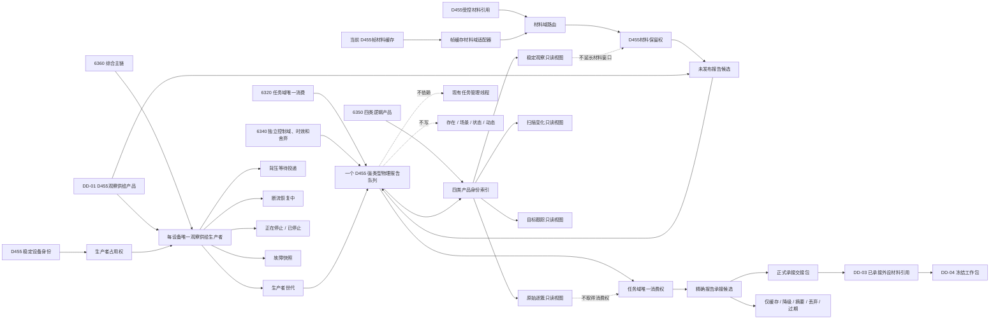

# DD-02 D455 外设报告队列分类视图、生产者生命周期函数结构清单与知识图谱

日期：2026-07-21

角色：设计窗口

状态：DD-02 函数、结构和依赖图已形成；#325 / DQ-217 已登记为依赖 #324 的施工计划；代码未实现

## 1. 依据与边界

依据：

- `规范/详细设计/D455外设报告队列分类视图与生产者生命周期详细设计.md`
- `流程图/20260721_DD02_D455外设报告队列分类视图与生产者生命周期流程图_v0.1.md`
- 6320、6340、6350、6360 正式规范
- DD-01 数据合同、流程图、函数结构清单与 #324 施工计划
- 当前帧缓存、上行桥、运行消息队列、模拟外设线程、任务管理线程和 D455 采集器代码事实

本记录把 DD-02 流程节点拆成结构、函数、所有者、状态、拒绝边和验证边。它不是代码许可；所有新类型和函数只有在 #324 形成 DD-01 实际接口、#325 执行前复核通过后才可实现。

范围一致性结论：正式规范、DD-02 详细设计、流程图、本文和 #325 施工计划共同限定为“受控材料保留、一个物理强类型报告队列、四类索引 / 非消费视图、任务域唯一消费能力、每设备唯一生产者和生命周期”；均排除 L0—L3 算法、真实常驻采集、任务匹配、冻结工作包、方法执行、领域提交和生产入口接线。

## 2. 结构清单

### 2.1 当前复用结构

| 结构 | 当前所有者 | DD-02 用途 | 写入方 | 读取方 | 生命周期 |
| --- | --- | --- | --- | --- | --- |
| `D455设备身份材料` | `适配.协议.D455采样材料` | 生产者按稳定设备身份互斥 | D455 采集器 / 隔离材料 | 生产控制域登记器 | 设备打开和生产控制域窗口 |
| `D455帧材料句柄` | `线程.缓存.D455帧材料` | 当前同步帧缓存适配入口 | 当前帧缓存 | 材料域适配器 | 当前缓存版本窗口 |
| `D455同步帧材料` | `适配.协议.D455采样材料` | 帧缓存材料域适配器内部只读寿命载体 | D455 采集器 / 模拟来源 | 材料域适配器 | 保留权存在期间 |
| `D455观察供给产品` | 预期由 `适配.协议.D455观察供给` 唯一拥有 | 队列不可变产品负载 | 后续产品形成器 | 生产者、队列、任务域 | 产品和消费窗口 |
| `D455受控材料引用` | 预期由 DD-01 协议唯一拥有 | 跨产品材料定位值 | 产品形成器 | 材料域、任务域 | 域、编号、版本当前时 |

当前 `运行消息`、`有界运行消息队列`、`外设采样材料线程` 和 `任务管理线程` 只作不适配证据，不进入 DD-02 正式依赖。

### 2.2 报告流转协议结构

| 结构 | 唯一所有者 | 用途 | 写入方 | 读取方 | 生命周期 / 失效 |
| --- | --- | --- | --- | --- | --- |
| `D455报告身份` | `线程.协议.D455报告流转` | 设备 + 世代 + 编号 + 版本定位报告 | 报告队列身份分配器 | 队列、生产者、任务域 | 队列世代内唯一；终结后仅作回执 |
| `D455报告状态` | 同上 | 候选、发布、保留和六类终结状态 | 报告队列 | 生产者、只读视图、任务域 | 报告流转窗口 |
| `D455报告投递策略` | 同上 | 可舍弃、摘要收口、不可舍弃 | 产品投递规格形成器 | 生产者、队列 | 单个报告投递窗口 |
| `D455报告投递约束` | 同上 | 优先级、最大年龄、策略和原因 | 生产者调用方 | 队列、任务域 | 单个报告投递窗口 |
| `D455报告处置原因` | 同上 | 过期、重复、无命中、积压等强类型原因 | 队列 / 任务域 | 回执、统计 | 终结回执生命周期 |
| `D455报告操作结果` | 同上 | 成功、逻辑内返回、内部逻辑错误 | 队列和生产者入口 | 调用方 | 单次调用 |
| `D455生产者身份` | 同上 | 设备、控制域编号和世代 | 生产控制域登记器 | 生产者、队列 | 生产者占用窗口 |
| `D455生产者状态` | 同上 | 八态生产生命周期 | 生产者 | DD-06 后续宿主、只读快照 | 生产者对象生命周期 |
| `D455生产者故障快照` | 同上 | 锁存外设错误和内部逻辑错误 | 生产者 | 控制域治理 | 故障至显式收口 |
| `D455报告队列配置` | 同上 | 容量、候选上限、时效和队列世代 | 运行期装配 | 队列 | 队列对象生命周期 |

### 2.3 受控材料域结构

| 结构 | 唯一所有者 | 用途 | 写入方 | 读取方 | 生命周期 / 失效 |
| --- | --- | --- | --- | --- | --- |
| `D455材料元数据` | `线程.材料域.D455受控引用` | 对照引用种类、批次、摘要和版本 | 来源适配器 | 材料域、队列候选读回 | 保留权窗口 |
| `D455材料来源适配器` | 同上 | 按材料域编号解析并保留来源材料 | 来源专用适配器实现 | 材料域路由 | 来源域登记窗口 |
| `D455材料保留权` | 同上 | 不透明、移动独占地延长只读材料寿命 | 来源适配器私有构造 | 报告候选、队列、承接交接包 | 析构或移动到后继时结束 |
| `D455材料保留组` | 同上 | 一一对应产品全部受控引用 | 材料域 | 报告候选 / 交接包 | 报告发布和消费窗口 |
| `D455材料域路由` | 同上 | 材料域编号到唯一适配器 | 运行期装配 | 产品材料保留入口 | 路由对象生命周期 |
| `D455材料域快照` | 同上 | 只读域编号、代次、保留计数 | 材料域 | 自检、诊断 | 单次读取 |
| `D455帧缓存材料域适配器` | 同上 | 当前帧句柄转受控引用并内部持有只读帧快照 | DD-02 材料域模块 | 产品形成器、材料域 | 适配器和保留权窗口 |

材料保留权内部可以使用运行期只读指针或共享寿命载体，但不得向报告队列、任务域或方法公开裸地址。

### 2.4 报告队列结构

| 结构 | 唯一所有者 | 用途 | 写入方 | 读取方 | 生命周期 / 失效 |
| --- | --- | --- | --- | --- | --- |
| `D455报告候选` | `线程.队列.D455观察供给报告` | 未发布候选的移动独占能力 | 报告队列 | 生产者发布编排 | 确认、撤销或析构 |
| `D455报告候选读回` | 同上 | 精确核对产品、身份、约束和材料元数据 | 报告队列 | 生产者 | 单次读回 |
| `D455报告只读视图项` | 同上 | 不消费地显示报告头、状态、质量和产品值 | 报告队列 | 诊断 / 控制面板 / 任务域匹配材料 | 单次视图快照 |
| `D455任务域消费权` | 同上 | 唯一授权精确认领和终结 | 报告队列一次签发 | DD-03 任务域 | 队列世代；不可再次签发 |
| `D455报告承接候选` | 同上 | 同一报告唯一认领能力 | 报告队列 | DD-03 任务域 | 释放、承接、终结或析构 |
| `D455报告承接交接包` | 同上 | 产品值和全部材料保留权的唯一转移包 | 报告队列 | DD-03 已承接材料引用 | 消费窗口结束时析构 |
| `D455报告终结回执` | 同上 | 正式承接 / 缓存 / 降级 / 摘要 / 丢弃 / 过期结果 | 报告队列 | 任务域和治理统计 | 有界回执窗口 |
| `D455报告队列快照` | 同上 | 容量、候选、活动、四索引、保留和终结计数 | 报告队列 | 自检、诊断 | 单次读取 |

队列内部唯一拥有物理活动记录、发布顺序、四类产品身份索引、候选代次、承接代次和队列互斥锁；这些内部类型不得被其它模块平行声明。

### 2.5 生产者结构

| 结构 | 唯一所有者 | 用途 | 写入方 | 读取方 | 生命周期 / 失效 |
| --- | --- | --- | --- | --- | --- |
| `D455生产控制域登记器` | `线程.生产者.D455观察供给` | 按设备稳定身份维护唯一活动占用和世代 | DD-06 后续运行期组合器 | 生产者取得占用入口 | 运行期上下文生命周期 |
| `D455生产者占用权` | 同上 | 不可伪造的同设备唯一生产能力 | 登记器 | 单个生产者对象 | 收口释放；不可复制 |
| `D455待投递报告包` | 同上 | 背压时保存唯一不可舍弃产品和材料保留 | 生产者 | 重试入口 | 背压解除或具名终结 |
| `D455观察供给生产者` | 同上 | 生命周期和发布编排 | DD-06 后续控制线程调用 | 报告队列、只读快照 | 单个设备世代 |
| `D455生产者快照` | 同上 | 状态、世代、背压、断流、故障和停止材料 | 生产者 | 控制域治理 / 自检 | 单次读取 |

## 3. 函数清单

### 3.1 报告流转协议纯值函数

| 函数候选 | 输入 | 输出 | 前置拒绝 | 内部逻辑错误边界 | 流程节点 |
| --- | --- | --- | --- | --- | --- |
| `验证D455报告投递约束` | 产品类型、策略、时效和原因 | 报告操作结果 | 未知策略、零时效、目标丢失可舍弃 | 已形成约束读回后字段变化 | G、J |
| `验证D455报告状态迁移` | 前状态、后状态、处置原因 | 报告操作结果 | 不适用的请求分支 | 未列入状态图的迁移 | O、U、W、Y、Z |
| `验证D455生产者状态迁移` | 前状态、后状态、原因 | 报告操作结果 | 重复启动、恢复不足 | 跳过启动 / 停止或覆盖背压包 | E、K、AB、AE、AG |

### 3.2 材料域函数

| 函数候选 | 输入 | 输出 | 前置拒绝 | 内部逻辑错误边界 | 流程节点 |
| --- | --- | --- | --- | --- | --- |
| `登记D455材料来源适配器` | 域编号、代次、适配器 | 操作结果 | 零编号、重复登记 | 同域同代次指向不同适配器 | D、H |
| `保留D455受控材料引用` | 单引用 | 保留权 + 元数据 | 域不存在、版本过期、种类不符 | 同引用读回两个摘要 | H、I |
| `保留D455产品全部材料` | 完整产品 | 保留组 | 任一引用不能保留 | 引用和保留权一对一关系矛盾 | H、I |
| `读取D455保留材料元数据` | 保留权 | 元数据 | 能力无效或已移动 | 能力绑定和读回元数据不一致 | M |
| `转换并保留D455帧缓存材料` | 帧句柄、域身份 | 受控引用 + 保留权 | 缓存目标不存在、过期、摘要不符 | 同缓存版本读回不同帧材料 | H、I |
| `读取D455材料域快照` | 无 | 值式快照 | 无 | 适配器和保留计数矛盾 | 验证边 |

### 3.3 报告队列发布函数

| 函数候选 | 输入 | 输出 | 前置拒绝 | 内部逻辑错误边界 | 流程节点 |
| --- | --- | --- | --- | --- | --- |
| `准备D455报告候选` | 产品、投递约束、材料保留组、生产者身份 | 候选 | 队列满、已停止、产品过期 | 同身份不同内容、容量 / 计数不一致 | J、L |
| `读取D455报告候选` | 候选 | 候选读回 | 候选无效 | 产品、约束、身份或材料元数据变化 | M、N |
| `确认发布D455报告` | 候选 | 已发布读回 | 候选已决定或跨队列 | 物理序列和唯一索引不能同锁成立 | O、P |
| `撤销D455报告候选` | 候选 | 已撤销回执 | 候选已决定 | 容量或材料保留未精确释放 | X1 |
| `按身份读取D455已发布报告` | 报告身份 | 只读报告值 | 目标不存在或已终结 | 同身份读回不同内容 | P、Q |

### 3.4 分类视图和唯一消费函数

| 函数候选 | 输入 | 输出 | 前置拒绝 | 内部逻辑错误边界 | 流程节点 |
| --- | --- | --- | --- | --- | --- |
| `读取D455原始逐簇报告视图` | 视图范围 | 值式快照 | 合法空集合 | 索引指向不存在或错误类型 | Q |
| `读取D455稳定观察子集报告视图` | 视图范围 | 值式快照 | 合法空集合 | 同上 | Q |
| `读取D455扫描变化报告视图` | 视图范围 | 值式快照 | 合法空集合 | 同上 | Q |
| `读取D455目标跟踪报告视图` | 视图范围 | 值式快照 | 合法空集合 | 同上 | Q |
| `签发D455任务域唯一消费权` | 队列世代 | 唯一消费权 | 已签发、已有报告或队列已启动 | 出现两个有效消费权 | D |
| `准备按身份承接D455报告` | 消费权、报告身份、当前时间 | 承接候选 | 不存在、已认领、可舍弃报告过期 | 同报告出现两个候选 | S、T、U |
| `读取D455报告承接候选` | 消费权、候选 | 产品值、元数据、时效 | 能力无效 | 候选读回与活动记录不一致 | U、V |
| `释放D455报告承接候选` | 消费权、候选、当前时间 | 待承接或过期回执 | 候选已决定 | 状态 / 索引恢复不一致 | W |
| `确认正式承接D455报告` | 消费权、候选 | 唯一交接包 | 产品类型不允许正式承接 | 交接包、索引、容量或材料移动不一致 | Y |
| `具名终结D455报告` | 消费权、候选、处置和原因 | 终结回执 | 处置与产品 / 策略不匹配 | 终结后记录、索引或材料仍活动 | Z |
| `治理D455可舍弃过期报告` | 当前时间 | 过期回执组 | 无过期项为空 | 删除不可舍弃报告或索引计数矛盾 | Z |
| `读取D455报告队列快照` | 无 | 值式快照 | 无 | 候选 + 活动 + 可用容量不闭合 | 验证边 |
| `停止D455报告队列` | 强类型停止原因 | 操作结果 | 仍有不可舍弃项且无终结原因 | 静默清空或停止后新增报告 | AE—AG |

### 3.5 生产者函数

| 函数候选 | 输入 | 输出 | 前置拒绝 | 内部逻辑错误边界 | 流程节点 |
| --- | --- | --- | --- | --- | --- |
| `取得D455生产者占用` | 登记器、设备身份 | 占用权、生产者身份 | 同设备已有占用 | 同设备两个有效占用、世代倒退 | A—C |
| `启动D455观察供给生产者` | 占用权、队列、材料域、消费权已签发证据 | 操作结果 | 配置不全、重复启动 | 状态 / 世代绑定不一致 | D、E |
| `投递D455观察供给产品` | 产品、约束、当前时间 | 已发布 / 舍弃 / 摘要 / 背压结果 | 未运行、产品无效 | 确认后读回矛盾 | F—Q |
| `重试D455待投递产品` | 当前时间 | 已发布或继续背压 | 无待投递包 | 待投递身份或内容变化 | K、K1、L |
| `登记D455观察来源断流` | 强类型原因、时间 | 状态结果 | 未运行或已停止 | 原因丢失、跳过恢复态 | AA、AB |
| `确认D455观察来源恢复` | 同设备来源证据 | 状态结果 | 设备不同、证据不足 | 未经确认直接恢复运行 | AC、E |
| `请求停止D455观察供给生产者` | 停止原因 | 状态结果 | 已停止 | 新产品仍可进入 | AD、AE |
| `收口D455观察供给生产者` | 强制终结原因可空 | 已停止 / 等待 / 故障 | 不可舍弃项未收口 | 占用权提前释放或静默丢失 | AF、AG |
| `读取D455观察供给生产者快照` | 无 | 值式快照 | 无 | 状态和待投递 / 故障槽矛盾 | 验证边 |

## 4. 流程节点到函数映射

| 流程节点 | 函数 / 结构 | 设计包 |
| --- | --- | --- |
| A—C 设备唯一占用 | `D455生产控制域登记器`、`取得D455生产者占用` | DD-02 |
| D—E 消费权和启动 | `签发D455任务域唯一消费权`、`启动D455观察供给生产者` | DD-02；DD-06 装配 |
| F—I 产品与材料保留 | DD-01 验证 + `保留D455产品全部材料` | DD-01 + DD-02 |
| J—K 队列满和背压 | `投递D455观察供给产品`、`D455待投递报告包` | DD-02 |
| L—P 候选和原子发布 | `准备 / 读取 / 确认发布D455报告` | DD-02 |
| Q 四类视图 | 四个 `读取D455*报告视图` | DD-02 |
| S—U 唯一认领 | `准备按身份承接D455报告`、`D455报告承接候选` | DD-02 |
| V—Z 匹配后处理 | 释放、正式承接、具名终结 | DD-02 接口 + DD-03 裁决 |
| AA—AC 断流恢复 | 断流和恢复入口 | DD-02 状态 + DD-06 驱动控制 |
| AD—AG 停止收口 | 请求停止、队列停止、生产者收口 | DD-02 + DD-06 装配 |

## 5. 知识图谱

## 6. 关键知识边

| 主体 | 关系 | 客体 | 含义 |
| --- | --- | --- | --- |
| 四类产品 | 共用 | 一个物理报告队列 | 产品类型不等于物理队列编号 |
| 一个报告 | 进入 | 唯一产品索引 | 不复制产品和材料保留权 |
| 四类视图 | 不取得 | 任务域消费权 | 只读显示不参与正式承接 |
| 任务域 | 唯一持有 | 消费权 | 自我线程、普通工作线程和方法不能绕过 |
| 报告候选 | 候选期不可见于 | 视图和消费者 | 确认点之前无半发布结构 |
| 确认发布 | 同时写入 | 物理序列和产品索引 | 两者是一个原子可见点 |
| 报告队列 | 持有 | 材料保留权 | 已发布报告在消费窗口内可回查材料 |
| 正式承接 | 移动 | 材料保留权到交接包 | 一个报告只交给任务域一次 |
| 生产者占用权 | 由设备身份裁决 | 唯一生产控制域 | 不依赖线程编号 |
| 同一设备 | 排斥 | 第二生产者 | 不同设备仍可并发 |
| 不可舍弃报告 | 队列满时触发 | 背压 | 不能覆盖或静默删除 |
| 断流 | 只触发 | 恢复 / 故障状态 | DD-02 不自行伪造驱动恢复 |
| 报告和队列项 | 不是 | 世界事实 | 后续仍需方法与领域服务 |

## 7. 验证边

| 验证对象 | 读回关系 | 失败分类 |
| --- | --- | --- |
| 产品引用组 | 引用完整集合 = 材料保留权完整集合 | 准备前不成立为逻辑内拒绝；候选后不成立为内部逻辑错误 |
| 候选身份 / 产品 / 约束 | 准备输入 = 候选读回 | 内部逻辑错误、精确撤销 |
| 已发布报告 | 物理记录 = 唯一产品索引 = 普通读回 | 内部逻辑错误、生产者隔离 |
| 队列容量 | 候选 + 活动 + 可用 = 容量 | 内部逻辑错误 |
| 消费权 | 一个队列世代恰一有效签发 | 二次签发逻辑内拒绝；两个有效权为内部逻辑错误 |
| 承接候选 | 一个活动报告最多一个有效候选 | 内部逻辑错误 |
| 正式交接 | 活动记录和索引删除，材料权恰一移动 | 内部逻辑错误 |
| 生产者占用 | 一个设备最多一个有效占用 | 内部逻辑错误 |
| 背压 | 不可舍弃待投递包身份 / 内容不变 | 变化或覆盖为内部逻辑错误 |
| 停止 | 不可舍弃报告已承接或有强类型终结原因 | 无原因静默清空为内部逻辑错误 |

## 8. 缺口与后继

DD-02 已把 CG-04、CG-05、CG-09、CG-13 的队列和生产控制部分拆成可施工结构与函数面，但当前仍缺：

1. #324 实现 DD-01 产品和值式验证实际接口。
2. #325 实现材料域、队列、生产者和自检模块。
3. DD-03 的等待项匹配、任务 / 工作项绑定和已承接材料引用。
4. DD-04 的冻结工作包和观察 / 扫描 / 跟踪材料入口。
5. DD-06 的真实常驻线程、驱动、算法生产者和任务域消费者装配。
6. DD-07 的真实 D455 连续样本、断流恢复和端到端证据。

只有 #325 完成任务分支、独立集成和设计归档后，才能声明“SDK 无关 D455 报告队列和生产者生命周期基础设施已实现”。即使如此，也不得宣称真实 D455 已连续生产、任务域已业务承接或自我循环已接通。
