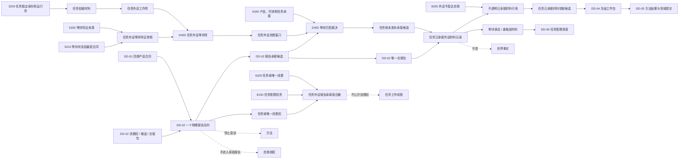

# DD-03 D455 任务域唯一消费、已承接材料引用函数结构清单与知识图谱

日期：2026-07-21

角色：设计窗口

状态：DD-03 函数、结构和依赖图已形成；#326 / DQ-218 登记为依赖 #324、#325 的施工计划；代码未实现

## 1. 依据与范围

依据：

- `规范/详细设计/D455任务域唯一消费与已承接材料引用详细设计.md`
- `流程图/20260721_DD03_D455任务域唯一消费与已承接材料引用流程图_v0.1.md`
- 3200、5200、5210、5230、6320、6340、8100、8200 正式规范
- DD-01 产品合同和 #324 施工计划
- DD-02 队列 / 生产者合同和 #325 施工计划
- 当前任务请求协议、任务管理线程、任务工作线程、任务业务服务、任务数据操作、任务执行组合器和运行期业务装配代码事实

本记录把 DD-03 流程节点拆成结构、函数、所有者、状态、拒绝边和验证边。它不是代码许可；#326 只有在 #324、#325 完成并集成、实际接口与假定合同一致后才可执行。

范围一致性结论：正式规范、DD-03 详细设计、配套流程图、本文和 #326 施工计划共同限定为“任务域唯一消费、最小等待特征快照、工作项、消费窗口、确定性匹配、任务侧候选、DD-02 交接包原子安装、不透明已承接引用和领取候选”；均排除冻结请求改造、方法入口、世界事实提交、生产线程装配和真实 D455。

## 2. 结构清单

### 2.1 当前复用结构

| 结构 | 当前 / 预期所有者 | DD-03 用途 | 写入方 | 读取方 | 生命周期 |
| --- | --- | --- | --- | --- | --- |
| `节点句柄` | `核心/句柄.h` | 任务稳定身份 | 任务领域 | DD-03 服务 | 节点版本当前时 |
| `任务权威材料` | `领域.数据操作.需求任务方法` | 回读任务结构、生命周期关系和版本 | 任务领域 | DD-03 服务 | 单次权威读取 |
| `D455观察供给产品` | 预期 DD-01 协议 | 匹配产品值和完整来源 | DD-01 产品形成器 | DD-02 / DD-03 | 产品和交接窗口 |
| `D455任务域消费权` | 预期 DD-02 队列 | 唯一允许认领 / 终结报告 | DD-02 队列一次签发 | DD-03 组合器 | 队列世代 |
| `D455报告承接候选` | 预期 DD-02 队列 | 确认前独占报告 | DD-02 队列 | DD-03 组合器 | 释放、交接、终结或析构 |
| `D455报告承接交接包` | 预期 DD-02 队列 | 唯一移动产品和材料寿命 | DD-02 队列 | DD-03 数据操作 | 消费窗口 / 工作包寿命 |

`运行消息`、`有界运行消息队列`、线程编号、任务回执和显示字段不进入 DD-03 机器结构。

### 2.2 协议结构

| 结构 | 唯一所有者 | 用途 | 写入方 | 读取方 | 生命周期 / 失效 |
| --- | --- | --- | --- | --- | --- |
| `任务外设工作项身份` | `线程.协议.任务外设材料承接` | 编号 + 版本 + 调度批次定位工作项 | 任务管理调用方 | 服务、数据操作、DD-04 | 运行期上下文内 |
| `任务外设等待项身份` | 同上 | 定位一个等待合同版本 | 任务领域 | 服务、数据操作 | 等待版本窗口 |
| `任务外设消费窗口身份` | 同上 | 定位一次等待 / 有界订阅窗口 | 服务 | 数据操作、DD-04 | 打开至关闭 |
| `任务已承接外设材料身份` | 同上 | 上下文世代 + 编号 + 版本定位记录 | 数据操作 | 服务、DD-04 | 记录历史 |
| `任务外设工作项状态` | 同上 | 登记、活动、挂起、结束、取消、失效 | 服务 / 数据操作 | 调度和读取 | 工作项版本 |
| `任务外设等待项状态` | 同上 | 当前等待、满足、过期、取消、失效 | 服务 / 数据操作 | 任务管理 | 等待版本 |
| `任务外设消费窗口状态` | 同上 | 打开、关闭、过期 | 服务 / 数据操作 | 组合器、DD-04 | 窗口版本 |
| `任务已承接外设材料状态` | 同上 | 候选、待领取、保留、工作包、结束、隔离 | 数据操作 | 服务、组合器、DD-04 | 承接记录版本 |
| `任务外设等待特征快照` | 同上 | 5200 / 5210 最小等待特征集合 | 任务服务调用方 | DD-03 服务 | 等待版本和状态段当前时 |
| `D455任务外设等待约束` | 同上 | 产品、设备、范围、目标、质量、时效和重复策略 | 任务管理调用方 | 服务 / 组合器 | 等待项版本 |
| `任务已承接外设材料引用` | 同上 | 不透明任务 / 工作项 / 窗口绑定引用 | 数据操作 | DD-04 和只读查询 | 当前性复核通过时 |
| `任务外设承接操作结果` | 同上 | 成功、逻辑内返回、内部逻辑错误和具名原因 | 各入口 | 调用方 | 单次调用 |

### 2.3 数据操作结构

| 结构 | 唯一所有者 | 用途 | 写入方 | 读取方 | 生命周期 / 失效 |
| --- | --- | --- | --- | --- | --- |
| `任务外设工作项记录` | `领域.数据操作.任务外设材料承接` | 任务、生命周期来源、状态和容量 | 数据操作 | 服务、快照 | 工作项历史 |
| `D455任务外设等待项记录` | 同上 | 等待特征快照和产品约束 | 数据操作 | 服务、组合器 | 等待项历史 |
| `任务外设消费窗口记录` | 同上 | 绑定、时间、数量和状态 | 数据操作 | 服务、组合器、DD-04 | 窗口历史 |
| `任务已承接外设材料候选` | 同上 | 确认前预留记录和全部索引槽 | 数据操作 | 组合器 | 撤销、确认或析构 |
| `任务已承接外设材料候选读回` | 同上 | 核对所有绑定和来源产品 | 数据操作 | 组合器 | 单次读取 |
| `任务已承接外设材料记录` | 同上 | 唯一持有交接包和承接状态 | 数据操作 | 服务、DD-04 | 窗口 / 工作包和历史 |
| `任务已承接材料领取候选` | 同上 | 一个记录唯一工作包领取能力 | 数据操作 | DD-04 | 释放、确认或析构 |
| `任务外设材料承接快照` | 同上 | 计数、索引、窗口、候选和隔离读回 | 数据操作 | 自检、诊断 | 单次读取 |

数据操作内部维护：

```text
工作项身份索引
等待项身份索引
窗口身份索引
报告身份 -> 当前承接记录唯一索引
任务 / 工作项 / 窗口 -> 承接记录索引
候选代次和领取代次
容量计数和内部隔离集合
```

### 2.4 服务与组合器结构

| 结构 | 唯一所有者 | 用途 | 生命周期 |
| --- | --- | --- | --- |
| `任务外设材料承接业务服务` | `领域.服务.任务外设材料承接` | 权威任务读取、登记、匹配、当前性和领取准入 | 运行期上下文 |
| `D455任务等待匹配裁决` | 同上 | 记录匹配 / 不匹配 / 终结及强类型依据 | 单次候选 |
| `任务外设报告承接组合器` | `领域.组合.任务外设报告承接` | 唯一持有消费权并跨 DD-02 / DD-03 编排 | 队列世代 |
| `任务外设报告承接组合器快照` | 同上 | 消费权代次、承接轮次、状态和故障锁存 | 单次读取 |

## 3. 函数清单

### 3.1 协议纯值函数

| 函数候选 | 输入 | 输出 | 前置拒绝 | 内部逻辑错误边界 | 流程节点 |
| --- | --- | --- | --- | --- | --- |
| `验证任务外设工作项身份` | 工作项身份 | 操作结果 | 零编号 / 版本 / 批次 | 已发布身份被原地改写 | C—D |
| `验证任务外设等待特征快照` | 特征类型、值、来源、版本 | 操作结果 | 缺类型、来源、生产者或重触发 | 当前状态段与特征集合矛盾 | E—F |
| `验证D455任务外设等待约束` | 产品、范围、质量、时效和上限 | 操作结果 | 未知产品、零时效 / 数量 | 已发布约束字段变化 | E—H |
| `验证任务外设消费窗口` | 窗口值 | 操作结果 | 错绑定、时间倒置、零上限 | 同版本两个绑定 | G—H |
| `验证任务已承接外设材料引用` | 不透明引用 | 操作结果 | 零身份或绑定不完整 | 当前引用映射多个记录 | AC—AD |
| `验证任务外设承接状态迁移` | 前后状态和原因 | 操作结果 | 不适用请求 | 跳过候选 / 保留 / 完成状态 | S—AL |

### 3.2 数据操作函数

| 函数候选 | 输入 | 输出 | 前置拒绝 | 内部逻辑错误边界 | 流程节点 |
| --- | --- | --- | --- | --- | --- |
| `登记任务外设工作项` | 工作项记录 | 操作结果 | 无效身份、同身份异义 | 写后完整读回不同 | C—D |
| `登记D455任务外设等待项` | 工作项、特征快照、约束 | 操作结果 | 工作项非活动、特征不全 | 当前等待索引不唯一 | E—F |
| `打开任务外设消费窗口` | 任务、工作项、等待项、窗口 | 操作结果 | 绑定或时限无效 | 同版本双绑定 | G—H |
| `读取当前任务外设窗口快照` | 当前时间 | 稳定排序快照 | 合法空集合 | 冻结快照内重复身份 | I—J |
| `准备任务已承接外设材料候选` | 全部绑定、报告和产品元数据 | 移动独占候选 | 容量不足、重复、版本漂移 | 报告索引和候选槽矛盾 | S—T |
| `读取任务已承接外设材料候选` | 候选 | 候选读回 | 能力无效 | 输入和读回不一致 | V—W |
| `撤销任务已承接外设材料候选` | 候选 | 操作结果 | 已决定 | 容量 / 索引未精确释放 | U、X1 |
| `安装并确认任务已承接外设材料` | 候选、DD-02 交接包 | 不透明引用 | 确认前不允许调用 | 安装分配 / 抛出、发布读回矛盾 | Y—AB |
| `按引用读取任务已承接外设材料` | 引用和期望绑定 | 只读产品 / 元数据视图 | 过期、错任务 / 工作项 / 窗口 | 当前记录缺交接包 | AC—AD |
| `准备领取任务已承接外设材料` | 引用和用途 | 领取候选 | 已领取、过期、错用途 | 两个有效领取候选 | AD—AE |
| `释放任务已承接外设材料领取候选` | 领取候选 | 操作结果 | 已决定 | 状态不能恢复待领取 | AF—AG |
| `确认任务已承接外设材料进入工作包` | 领取候选、工作包身份 | 操作结果 | DD-04 复核未通过 | 同记录进入两个工作包 | AF—AH |
| `结束任务已承接外设材料消费` | 工作包完成材料 | 操作结果 | 错工作包 | 交接包寿命提前释放 | 后继 |
| `关闭任务外设消费窗口` | 窗口、强类型原因 | 已关闭 / 等待 / 内部错误 | 有保留中工作包 | 静默销毁隔离 / 不可舍弃材料 | AI—AL |
| `读取任务外设材料承接快照` | 无 | 值式快照 | 无 | 容量、索引、候选、记录不闭合 | 验证边 |

### 3.3 服务函数

| 函数候选 | 输入 | 输出 | 前置拒绝 | 内部逻辑错误边界 | 流程节点 |
| --- | --- | --- | --- | --- | --- |
| `创建任务外设工作项` | 任务、生命周期来源、工作项 | 操作结果 | 任务不完整 / 终态 / 版本错 | 权威任务与记录绑定不同 | C—D |
| `创建D455任务外设等待合同` | 工作项、等待特征、约束 | 操作结果 | 仅阶段枚举、缺生产者 / 重触发 | 当前等待特征集合不闭合 | E—F |
| `开启D455任务外设消费窗口` | 工作项、等待项、窗口 | 操作结果 | 非当前、过期、零上限 | 发布后绑定改变 | G—H |
| `复核D455报告与任务等待项匹配` | 任务 / 等待 / 窗口、候选产品 | 匹配裁决 | 合法不匹配 | 相同冻结输入得到两个最高结果 | N—Q |
| `准备D455任务已承接材料` | 匹配裁决和报告元数据 | 任务侧候选 | 当前性变化、容量不足 | 候选绑定不一致 | S—W |
| `确认D455任务已承接材料` | 候选、交接包 | 不透明引用 | 无确认后普通拒绝 | 发布后任何矛盾 | Y—AB |
| `读取D455任务已承接材料` | 引用、期望绑定 | 只读视图 | 失效、错绑定 | 当前记录缺产品 / 交接包 | AC—AD |
| `准备任务工作包领取外设材料` | 引用、DD-04 用途 | 领取候选 | 错用途 / 过期 / 重复 | 双领取 | AD—AE |
| `关闭D455任务外设消费窗口` | 窗口、原因 | 操作结果 | 保留中则等待 | 静默释放隔离材料 | AI—AL |

### 3.4 组合器函数

| 函数候选 | 输入 | 输出 | 前置拒绝 | 内部逻辑错误边界 | 流程节点 |
| --- | --- | --- | --- | --- | --- |
| `创建任务外设报告承接组合器` | 消费权、队列、服务 | 组合器 | 消费权无效 / 已移动 | 同队列世代两个有效所有者 | A—B |
| `承接下一条D455报告` | 当前时间 | 承接结果 | 无窗口 / 无报告 | 确定性排序产生歧义 | I—AC |
| `按等待项承接指定D455报告` | 等待项、报告身份、当前时间 | 承接结果 | 错等待 / 报告 | 绕过完整匹配 | K—AC |
| `治理D455过期或重复报告` | 报告候选、处置依据 | DD-02 终结 / 释放结果 | 不可舍弃或证据不足 | 静默删除重要报告 | Q、R |
| `读取任务外设报告承接组合器快照` | 无 | 值式快照 | 无 | 消费权代次和状态矛盾 | 验证边 |
| `停止任务外设报告承接组合器` | 强类型停止原因 | 已停止 / 等待 / 内部错误 | 活动保留中 | 提前释放消费权或交接包 | AI—AL |

## 4. 流程节点到函数映射

| 流程节点 | 函数 / 结构 | 设计包 |
| --- | --- | --- |
| A—B 唯一任务域消费者 | `D455任务域消费权`、`创建任务外设报告承接组合器` | DD-02 + DD-03 |
| C—F 工作项与等待特征 | 创建工作项 / 等待合同、特征快照 | DD-03 |
| G—J 消费窗口与确定性快照 | 打开窗口、读取当前窗口快照 | DD-03 |
| K—M 报告认领与读回 | DD-02 承接候选接口 | DD-02 |
| N—Q 权威重读和完整匹配 | `复核D455报告与任务等待项匹配` | DD-03 |
| P / R 不匹配收口 | DD-02 释放 / 具名终结 | DD-02 + DD-03 裁决 |
| S—W 任务侧预留 | 准备 / 读取 / 撤销任务侧候选 | DD-03 |
| X—AB 正式交接和原子发布 | DD-02 确认 + DD-03 安装确认 | DD-02 + DD-03 |
| AC 重触发材料 | 等待条件和重触发状态更新 | DD-03；任务调度由 DD-06 |
| AD—AH 工作包领取 | 领取候选和确认进入工作包 | DD-03 接口 + DD-04 使用 |
| AI—AL 窗口收口 | 关闭窗口和交接包寿命 | DD-03；DD-06 停止编排 |

## 5. 知识图谱



## 6. 关键知识边

| 主体 | 关系 | 客体 | 含义 |
| --- | --- | --- | --- |
| 队列世代 | 只签发一个 | 任务域消费权 | 唯一消费者不是线程号 |
| 组合器 | 移动持有 | 消费权 | 不向工作线程 / 方法公开 |
| 工作项 | 绑定 | 一个任务和生命周期来源版本 | 工作项不替代任务身份 |
| 等待项 | 必须同时具有 | 最小等待特征集合 | 仅有等待中枚举不够 |
| 消费窗口 | 绑定 | 任务 + 工作项 + 等待项 | 不能跨任务复用 |
| 报告头等待引用 | 仅提示 | 任务侧等待候选 | 命中后仍需权威重读 |
| 一个报告 | 最多形成 | 一个任务侧承接候选 / 记录 | 不同任务不能重复领走 |
| 任务侧候选 | 先于 | DD-02 正式确认 | 确认前预留全部容量 |
| DD-02 确认 | 移动产生 | 唯一交接包 | 报告不再回到活动队列 |
| 交接包 | 唯一进入 | 已承接材料记录 | 不复制产品和材料寿命 |
| 不透明引用 | 回到服务读取 | 当前记录 | 不包含指针和队列地址 |
| 已承接记录 | 最多签发一个 | 领取候选 | 一个材料只进一个工作包 |
| 原始逐簇产品 | 只能进入 | 任务域质量门 / 回查 | 不能直接成为方法材料 |
| 稳定 / 扫描 / 跟踪产品 | 待 | DD-04 方法映射复核 | DD-03 不选择方法 |
| 外设报告 | 不是 | 世界事实 / 自我治理消息 | 必须经方法和领域提交 |

## 7. 验证边

| 验证对象 | 读回关系 | 失败分类 |
| --- | --- | --- |
| 工作项 | 输入任务 / 生命周期来源 = 工作项读回 | 写前漂移逻辑内拒绝；写后不同为内部逻辑错误 |
| 等待项 | 特征类型 + 值 + 来源 + 版本 + 当前性完整 | 缺项逻辑内拒绝；当前记录不闭合为内部错误 |
| 窗口 | 一个版本恰一任务 / 工作项 / 等待项 | 双绑定内部逻辑错误 |
| 确定性匹配 | 同一冻结输入得到同一唯一候选 | 歧义为内部逻辑错误 |
| 报告候选 | DD-02 读回 = 匹配输入 | 确认前不一致追根因并撤销 |
| 任务侧候选 | 绑定、报告、产品和索引槽完整 | 不完整不进入 DD-02 确认 |
| 正式交接 | 报告离队 = 交接包恰一 = 任务记录恰一 | 确认后不一致内部隔离 |
| 不透明引用 | 上下文、任务、工作项、窗口、记录全部一致 | 错绑定逻辑内拒绝 |
| 领取候选 | 一个记录最多一个有效候选 | 两个候选内部逻辑错误 |
| 窗口关闭 | 无未收口保留 / 隔离材料 | 静默销毁内部逻辑错误 |

## 8. 当前缺口与后继

DD-03 已把 CG-05、CG-06 拆成可施工结构和函数面，但当前仍缺：

1. #324 实现 DD-01 产品合同。
2. #325 实现 DD-02 材料域、报告队列、消费权和交接包。
3. #326 实现本设计的协议、数据操作、服务、组合器和自检。
4. DD-04 把领取候选接入冻结工作包，并隔离观察 / 扫描 / 跟踪 / 识别入口。
5. DD-06 把组合器装配给生产任务管理角色并连续调度。
6. 完整 5200 / 5210 任务特征系统仍需另行审计；DD-03 只实现外设承接所需的最小等待特征快照。

只有 #326 完成任务分支、独立集成和设计归档后，才能声明“SDK 无关任务域外设报告承接基础设施已实现”。即使如此，也不得宣称生产任务管理线程已经持续消费、冻结工作包或方法已经接通、CG-05 / CG-06 全链修复或真实 D455 已接入。
