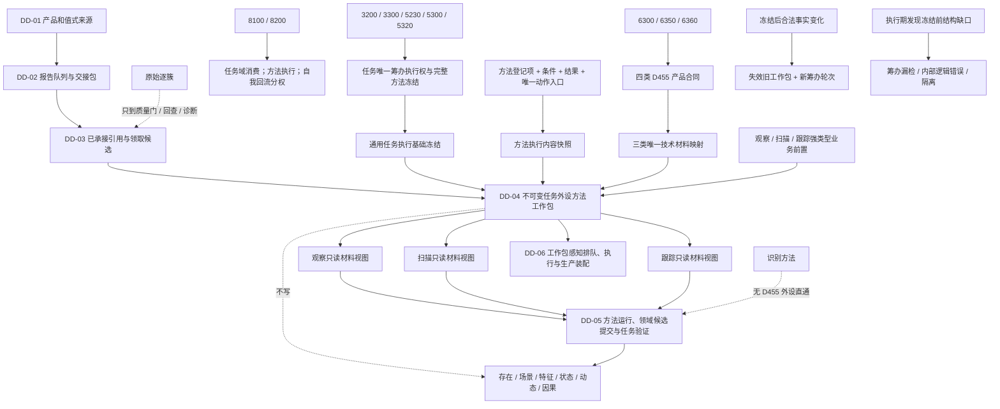

# DD-04 D455 冻结工作包、观察扫描跟踪方法入口函数结构清单与知识图谱

日期：2026-07-21

角色：设计窗口

状态：DD-04 P0—P6 已完成；#327 / DQ-219 登记为依赖 #324—#326 的施工计划；代码未实现

## 1. 依据与范围

依据：

- `规范/详细设计/D455冻结工作包与观察扫描跟踪方法入口详细设计.md`
- `流程图/20260721_DD04_D455冻结工作包与观察扫描跟踪方法入口流程图_v0.1.md`
- 3200、3300、5230、5300、5320、6300、6350、6360、8100、8200 正式规范
- DD-01 四类产品合同、DD-02 报告队列合同、DD-03 已承接引用和领取候选合同
- 当前 `协议.任务执行请求`、`组合.任务执行`、`服务.方法`、`数据操作.需求任务方法` 和 `路由.任务执行调度` 代码事实

本记录把 DD-04 流程节点拆成结构、函数、所有者、状态、拒绝边、内部错误边和验证边。它不是代码许可；#327 只有在 #324—#326 全部实施、独立集成和设计归档，且实际接口与假定合同一致后才可执行。

范围一致性结论：正式规范、详细设计、MD / HTML 流程图、本文和 #327 施工计划共同限定为“通用基础冻结窄扩展、DD-03 唯一领取、不可变外设方法工作包、完整方法内容快照、三类产品到三类方法材料入口唯一映射、执行前当前性、只读材料视图、失效和具名结束”。均排除方法真实执行、世界事实提交、任务最终验证、需求复核、生产线程装配和真实 D455。

## 2. 结构清单

### 2.1 当前复用结构

| 结构 | 当前所有者 | DD-04 用途 | 写入方 | 读取方 | 当前事实 |
| --- | --- | --- | --- | --- | --- |
| `任务执行调度请求` | `线程.协议.任务执行请求` | 冻结调度身份、任务、时间和后继幂等材料 | 调度调用方 | 任务执行组合器、DD-04 | 已实现 |
| `任务执行冻结请求` | 同上 | 通用任务、方法、动作基础冻结 | 任务执行组合器 | DD-04、既有调度路由 | 已实现；当前只接受目标状态值变化适配器 |
| `任务执行适配器种类` | 同上 | 区分目标状态值变化与三类 D455 技术材料入口 | 协议定义 | 组合器、DD-04 | 当前只有 `任务目标状态值变化` |
| `任务权威材料` | `领域.数据操作.需求任务方法` | 任务、生命周期、选择和当前性回读 | 任务领域 | 任务执行组合器 | 已实现 |
| `方法登记项材料` | 同上 | 方法身份、生命周期和治理关系 | 方法领域 | DD-04 组合器 | 已实现 |
| `方法规格材料` | 同上 | 条件、结果、动作入口、关系、来源版本和动作键 | 方法领域 | DD-04 组合器 | 已实现并按稳定节点身份排序返回 |
| `任务已承接外设材料引用` | 预期 DD-03 协议 | 不透明定位唯一承接记录 | DD-03 | DD-04 | 上游假定，代码未形成 |
| `任务已承接材料领取候选` | 预期 DD-03 数据操作 | 确认前移动独占材料领取 | DD-03 | DD-04 | 上游假定，代码未形成 |
| `D455观察供给产品` | 预期 DD-01 协议 | 读取产品类型、身份、内容版本和来源元数据 | DD-01 / DD-02 / DD-03 | DD-04 | 上游假定，代码未形成 |

`任务管理线程`、`任务工作线程`、报告队列、线程编号、日志、控制台和显示字段不进入工作包结构。DD-04 不持有 DD-02 消费权、报告候选或交接包。

### 2.2 协议结构

| 结构 | 唯一所有者 | 用途 | 写入方 | 读取方 | 生命周期 / 失效 |
| --- | --- | --- | --- | --- | --- |
| `任务外设方法工作包身份` | `线程.协议.任务外设方法工作包` | 上下文世代 + 编号 + 版本 + 冻结轮次定位工作包 | 调用方 / 工作包服务 | 全部 DD-04 模块 | 运行期上下文和版本内 |
| `任务外设方法材料入口种类` | 同上 | 未定义、观察、扫描、跟踪 | 协议固定 | 适配器、组合器、DD-05 | 工作包不可变 |
| `任务外设方法工作包状态` | 同上 | 候选、已冻结、排队、执行、结束、失效、隔离 | 服务 / 数据操作 | DD-04、DD-06 | 独立状态版本链 |
| `任务外设方法工作包结束原因` | 同上 | 消费完成、失效、取消、过期、停止或隔离 | 具名结束入口 | DD-03、DD-05、审计 | 结束后只读 |
| `任务外设方法材料绑定快照` | 同上 | 绑定 DD-03 引用、工作项、窗口、产品身份和期限 | DD-04 组合器 | 工作包服务、DD-05 | 任一绑定变化即失效 |
| `任务外设方法业务前置引用` | 同上 | 强类型稳定身份、版本、生产者、当前性和期限 | 合法前置生产者 / 调用方 | DD-04 / DD-05 | 当前性版本和期限内 |
| `观察方法业务前置快照` | 同上 | 任务场景、观察范围、期望特征集合和规则版本 | 合法观察前置生产者 | 观察适配 | 工作包不可变 |
| `扫描方法业务前置快照` | 同上 | 自我内部场景、已确认存在集合、基准、覆盖和比较规则 | 合法扫描前置生产者 | 扫描适配 | 工作包不可变 |
| `跟踪方法业务前置快照` | 同上 | 已确认目标、唯一凭证、观察窗口、范围和约束 | 合法跟踪前置生产者 | 跟踪适配 | 工作包不可变 |
| `任务外设方法执行内容快照` | 同上 | 稳定冻结方法登记、条件、结果、动作和适配合同 | DD-04 组合器 | 当前性复核、DD-05 | 方法任一组成版本变化即失效 |
| `任务外设方法冻结工作包` | 同上 | 基础冻结 + 材料绑定 + 方法快照 + 前置 + 期限 / 验证 / 归因 / 禁止项 | 工作包服务 | DD-04—DD-06 | 发布后不可变 |
| `任务外设方法工作包操作结果` | 同上 | 强类型成功、逻辑内返回和内部错误原因 | 各入口 | 调用方 | 单次调用 |

### 2.3 数据操作结构

| 结构 | 唯一所有者 | 用途 | 写入方 | 读取方 | 生命周期 / 失效 |
| --- | --- | --- | --- | --- | --- |
| `任务外设方法工作包候选` | `领域.数据操作.任务外设方法工作包` | 确认前预留不可变内容、状态槽和索引容量 | 数据操作 | 服务、组合器 | 撤销、确认或析构 |
| `任务外设方法工作包候选读回` | 同上 | 精确比较全部冻结输入 | 数据操作 | 组合器 | 单次读取 |
| `任务外设方法工作包记录` | 同上 | 唯一持有已发布工作包和状态版本链 | 数据操作 | 服务、组合器、DD-05 / DD-06 | 工作包历史 |
| `任务外设方法工作包状态记录` | 同上 | 只增状态迁移和具名结束证据 | 数据操作 | 服务、审计 | 状态版本历史 |
| `任务外设方法工作包快照` | 同上 | 候选、当前、结束、失效和隔离读回 | 数据操作 | 自检、诊断 | 单次读取 |

数据操作内部维护：

```text
工作包身份唯一索引
DD-03 承接记录 -> 当前工作包唯一索引
任务 / 筹办轮次 -> 当前工作包索引
候选代次、状态代次和容量计数
内部隔离集合
```

### 2.4 服务、适配器与组合器结构

| 结构 | 唯一所有者 | 用途 | 生命周期 |
| --- | --- | --- | --- |
| `任务外设方法工作包业务服务` | `领域.服务.任务外设方法工作包` | 身份、候选、发布、当前性、状态、失效和结束准入 | 运行期上下文 |
| `任务外设方法材料入口合同` | `领域.适配.任务外设方法材料` | 把已有方法 / 动作证据窄映射到一个产品和一个只读视图 | 适配器构造后不可变 |
| `任务外设方法材料适配器` | 同上 | 验证唯一映射并形成三类只读投影 | 运行期上下文 |
| `观察方法材料只读视图` | 同上 | 稳定观察子集及观察前置的单次调用投影 | 一次 DD-05 调用 |
| `扫描方法材料只读视图` | 同上 | 扫描变化、基准、覆盖和比较规则投影 | 一次 DD-05 调用 |
| `跟踪方法材料只读视图` | 同上 | 目标、凭证、跟踪状态和可选坐标投影 | 一次 DD-05 调用 |
| `任务外设方法工作包组合器` | `领域.组合.任务外设方法工作包` | 编排 DD-03 领取、基础冻结、方法快照、适配、候选和确认 | 运行期上下文 |

入口合同不是新方法能力事实：它只能收窄已有方法条件、结果和动作入口的技术材料形状，不能召回、选择、创建、补全或扩展方法。合同集合在构造时完整验证后不可变；相同方法、动作和稳定键对应两个产品或两个视图属于装配内部错误。

## 3. 函数清单

### 3.1 通用任务执行窄扩展

| 函数候选 | 输入 | 输出 | 前置拒绝 | 内部逻辑错误边界 | 流程节点 |
| --- | --- | --- | --- | --- | --- |
| `验证任务执行适配器可冻结` | 适配器种类 | bool / 准入结果 | 未定义或未知适配器 | 已发布冻结含未知适配器 | H—J |
| `冻结任务执行请求` 窄扩展 | 调度请求、构造时支持动作键和适配器 | 基础冻结 | 请求无效、任务尚不可冻结、合法当前性变化 | 已选择方法的既有结构缺口 | I—J |
| `复核任务执行冻结当前性` | 基础冻结、预期阶段 | 组合状态 | 阶段或版本合法变化 | 权威读回结构矛盾 | U—V、AA |
| `确认任务进入排队中` 显式适配器门 | 基础冻结 | 既有排队结果 | 任一 D455 适配器 | 目标适配器读回矛盾 | DD-04 排除边 |
| `执行任务目标状态值变化` 显式适配器门 | 基础冻结、时间 | 既有执行结果 | 任一 D455 适配器 | 目标适配器内部写后矛盾 | DD-04 排除边 |

### 3.2 协议纯值函数

| 函数候选 | 输入 | 输出 | 前置拒绝 | 内部逻辑错误边界 | 流程节点 |
| --- | --- | --- | --- | --- | --- |
| `验证任务外设方法工作包身份` | 身份四元组 | 操作结果 | 零世代 / 编号 / 版本 / 轮次 | 已发布身份原地变化 | A—B |
| `验证任务外设方法业务前置引用` | 引用和前置 variant | 操作结果 | 缺身份、版本、生产者或期限 | 已发布 variant 与入口种类错配 | M—N |
| `验证任务外设方法材料绑定快照` | DD-03 引用、产品和期限 | 操作结果 | 错任务 / 工作项 / 窗口 / 产品 | 当前绑定映射多个承接记录 | D—F |
| `验证任务外设方法执行内容快照` | 方法、条件、结果、动作和合同 | 操作结果 | 内容不完整 | 同复合版本对应异义内容 | L—N |
| `验证任务外设方法冻结工作包` | 完整工作包 | 操作结果 | 缺基础冻结、绑定、前置、期限或版本 | 已发布工作包字段矛盾 | S—Y |
| `验证任务外设方法工作包状态迁移` | 前后状态、版本和原因 | 操作结果 | 不允许的业务请求 | 跳过确认 / 执行 / 结束阶段 | Z—AI |
| `验证任务外设方法工作包结束原因` | 当前状态、具名原因 | 操作结果 | 原因不适用 | 二次结束异义 | AB—AI |

### 3.3 数据操作函数

| 函数候选 | 输入 | 输出 | 前置拒绝 | 内部逻辑错误边界 | 流程节点 |
| --- | --- | --- | --- | --- | --- |
| `准备任务外设方法工作包候选` | 完整未发布工作包 | 移动独占候选 | 身份占用、容量不足 | 同身份异义当前候选 | P—Q |
| `读取任务外设方法工作包候选` | 候选 | 候选读回 | 候选失效 | 字段或索引读回不同 | S—T |
| `撤销任务外设方法工作包候选` | 候选 | 操作结果 | 已确认候选 | 无法精确撤销未发布槽 | R、X3 |
| `安装并发布任务外设方法工作包` | 候选、DD-03 确认标记 | 不可变快照 | 确认标记不匹配 | 确认后分配、抛异常或部分发布 | W—Y |
| `读取任务外设方法工作包` | 身份 | 不可变快照 | 不存在 / 历史失效 | 当前索引双记录 | Y—Z |
| `迁移任务外设方法工作包状态` | 身份、预期版本、目标状态 | 状态快照 | 合法版本漂移 | 状态链跳跃或双当前 | Z—AA |
| `失效任务外设方法工作包` | 身份、当前性原因 | 状态快照 | 已结束 | 原地改冻结内容 | AA—AB |
| `结束任务外设方法工作包` | 身份、具名原因 | 状态快照 | 已结束同义读回 | 二次异义结束 | AH—AI |
| `隔离任务外设方法工作包` | 身份、内部错误分类 | 隔离快照 | 无当前记录 | 释放材料或丢失绑定 | X4—X5 |
| `读取任务外设方法工作包快照` | 无 / 过滤身份 | 值式快照 | 无 | 索引、计数和记录不一致 | 自检 |

### 3.4 业务服务函数

| 函数候选 | 输入 | 输出 | 前置拒绝 | 内部逻辑错误边界 | 流程节点 |
| --- | --- | --- | --- | --- | --- |
| `准备任务外设方法冻结工作包` | 身份、基础冻结、绑定、快照、前置和期限 | 工作包候选 | 材料缺失、过期或不匹配 | 已选择方法结构在冻结前缺失 | B—Q |
| `确认任务外设方法冻结工作包` | 候选、DD-03 确认标记 | 工作包快照 | 确认前漂移 | 确认后发布 / 读回失败 | V—Y |
| `读取任务外设方法冻结工作包` | 身份 | 工作包快照 | 不存在 / 失效 | 当前索引异义 | Y—Z |
| `复核任务外设方法工作包当前性` | 工作包和当前外部快照 | 当前性结果 | 冻结后合法变化 | 冻结前缺口到执行期才暴露 | AA |
| `标记任务外设方法工作包已排队` | 身份、DD-06 证据 | 状态快照 | DD-06 证据缺失 | 未经工作包感知路由排队 | 后继 DD-06 |
| `标记任务外设方法工作包执行中` | 身份、DD-06 证据 | 状态快照 | 非已排队 / 当前性失效 | 双执行占用 | 后继 DD-06 |
| `失效任务外设方法工作包` | 身份、具名原因 | 状态快照 | 已结束 | 修改冻结内容 | AB |
| `具名结束任务外设方法工作包` | 身份、结束原因 | 状态快照 | 原因不适用 | 静默析构或异义二次结束 | AH—AI |

### 3.5 方法材料适配器函数

| 函数候选 | 输入 | 输出 | 前置拒绝 | 内部逻辑错误边界 | 流程节点 |
| --- | --- | --- | --- | --- | --- |
| `创建任务外设方法材料适配器` | 不可变合同集合 | 适配器 | 空合同、未知产品 / 入口 | 同键双映射 | H、N |
| `读取任务外设方法入口合同` | 方法、动作、稳定键 | 单一合同 | 无匹配 | 多个当前匹配 | H—N |
| `复核D455产品到方法入口映射` | 产品、适配器、合同、前置 | 操作结果 | 产品 / 前置不匹配 | 同输入出现两个合法入口 | F—N |
| `形成观察方法材料只读视图` | 当前工作包、DD-03 只读解析 | 观察视图 | 空稳定子集、过期或错入口 | 负载与产品身份不一致 | AC—AD |
| `形成扫描方法材料只读视图` | 当前工作包、DD-03 只读解析 | 扫描视图 | 缺基准 / 覆盖 / 比较规则 | 变化项与内容版本矛盾 | AC—AE |
| `形成跟踪方法材料只读视图` | 当前工作包、DD-03 只读解析 | 跟踪视图 | 缺目标 / 凭证 / 窗口 | 丢失状态伪造坐标 | AC—AF |
| `读取任务外设方法材料适配器快照` | 无 | 值式合同快照 | 无 | 构造后合同变化 | 自检 |

### 3.6 组合器函数

| 函数候选 | 输入 | 输出 | 前置拒绝 | 内部逻辑错误边界 | 流程节点 |
| --- | --- | --- | --- | --- | --- |
| `创建任务外设方法工作包组合器` | DD-03 服务、任务执行组合器、方法服务、工作包服务、适配器 | 组合器 | 任一依赖无效 | 适配合同装配歧义 | A—H |
| `冻结观察方法工作包` | 请求、观察前置 | 工作包结果 | 产品 / 前置不匹配 | 观察映射歧义 | A—Z |
| `冻结扫描方法工作包` | 请求、扫描前置 | 工作包结果 | 缺基准 / 覆盖 | 扫描映射歧义 | A—Z |
| `冻结跟踪方法工作包` | 请求、跟踪前置 | 工作包结果 | 缺目标 / 凭证 / 窗口 | 跟踪映射歧义 | A—Z |
| `读取任务外设方法工作包材料视图` | 工作包身份 | 三类视图 variant | 失效 / 过期 / 错入口 | 已发布工作包与材料错配 | AA—AF |
| `复核任务外设方法工作包执行前当前性` | 工作包身份、当前时间 | 当前性结果 | 冻结后合法变化 | 筹办漏检 | AA—X5 |
| `失效并结束未执行工作包` | 身份、原因 | 结束结果 | 已执行或已结束 | 未结束 DD-03 材料消费 | AB |
| `完成任务外设方法工作包材料消费` | 身份、DD-05 结果分类 | 结束结果 | 非具名终态 | 释放错材料或二次结束 | AH—AI |
| `停止任务外设方法工作包组合器` | 停止时间 | 快照 | 新请求已拒绝 | 静默销毁已发布 / 隔离包 | AH—AI |

## 4. 流程节点到所有者映射

| 流程节点 | 核心动作 | 唯一所有者 |
| --- | --- | --- |
| A—D | 任务筹办权前提、DD-03 领取候选和绑定当前性 | 任务领域 + DD-03；DD-04 只消费 |
| E—H | 产品合同读取和技术适配器选择 | DD-01 值式协议 + DD-04 适配器 |
| I—J | 通用任务 / 方法 / 动作基础冻结 | 既有任务执行组合器窄扩展 |
| L—N | 完整条件、结果、动作和入口合同快照 | 方法服务只读 + DD-04 组合器 |
| P—Y | 工作包候选、读回、DD-03 确认和无失败发布 | DD-04 服务 / 数据操作 + DD-03 确认入口 |
| Z—AB | 当前性、失效和工作包状态 | DD-04 工作包服务 |
| AC—AF | 观察 / 扫描 / 跟踪只读视图 | DD-04 方法材料适配器 |
| AG | 方法运行和候选输出 | DD-05 后继 |
| AH—AI | 工作包和材料消费具名结束 | DD-04 组合器 + DD-03 结束入口 |

## 5. 知识图谱



## 6. 状态与并发图

```text
未发布候选
-> 已冻结待排队
-> 已排队                 # 由 DD-06 正式入口触发
-> 执行中                 # 由 DD-06 正式入口触发
-> 已结束

已冻结待排队 / 已排队
-> 已失效
-> 已结束

任一确认后内部矛盾
-> 内部隔离
```

并发隔离：

```text
同一任务筹办：任务稳定身份唯一筹办执行权串行
同一 DD-03 承接记录：最多一个领取候选、一个当前工作包
同一工作包身份：最多一个候选、一个当前记录和一条状态版本链
不同任务 / 工作项：允许并发，即使来源同一根需求、同一 D455 或同一复用方法
```

## 7. 当前差距与后继边界

| 差距 | DD-04 处理 | 后继 |
| --- | --- | --- |
| 通用冻结只支持目标状态值变化 | 窄扩展三个 D455 可冻结适配器；既有排队 / 执行入口继续拒绝 | DD-06 工作包感知排队 |
| 冻结不含 DD-03 引用和产品绑定 | 独立工作包，不污染通用冻结 | 无 |
| 方法没有单字段内容版本 | 用完整方法证据组形成 DD-04 复合快照 | 通用方法代际另案 |
| 没有观察 / 扫描 / 跟踪材料入口 | 建立不可变技术适配合同和三类只读视图 | DD-05 真实方法执行 |
| 已确认存在、扫描基准和目标凭证生产者不完整 | 只定义强类型前置引用，生产接线保持门控 | DD-05 / 相邻专项 |
| 任务线程未消费工作包 | 本包保持线程与装配差异为 0 | DD-06 |

## 8. P6 五件套一致性与安全登记

一致文件：

```text
规范/详细设计/D455冻结工作包与观察扫描跟踪方法入口详细设计.md
流程图/20260721_DD04_D455冻结工作包与观察扫描跟踪方法入口流程图_v0.1.md
流程图/20260721_DD04_D455冻结工作包与观察扫描跟踪方法入口流程图_v0.1.html
项目记忆/设计记录/20260721_DD04_D455冻结工作包观察扫描跟踪方法入口函数结构清单与知识图谱.md
计划/20260721_DD04_D455冻结工作包与观察扫描跟踪方法入口代码实施切片_v0.1.md
```

核对结论：

1. 输入都限定为任务执行调度请求、DD-03 不透明已承接引用和三类强类型前置。
2. 核心处理都限定为 DD-03 领取、基础冻结、完整方法快照、唯一适配、候选、确认和无失败发布。
3. 输出都限定为不可变工作包和一次调用内只读材料视图，不产生世界事实、任务完成或需求满足。
4. 原始逐簇和识别外设直通在五件套中均被禁止。
5. 逻辑内返回、确认前撤销、确认后隔离和筹办漏检分类一致。
6. 允许文件只覆盖通用冻结窄扩展、六个 DD-04 真模块、工程 / 入口最小登记和专属实施记录。
7. #327 / DQ-219 只登记为依赖门控待执行；未创建 worktree、未派发、未修改 C++、未运行构建。

当前完成边界：DD-04 的 P0—P6 设计链和安全登记完成，不等于 #327 已实施，不解除 #324—#326 依赖，也不证明 D455 或自我内部循环已经接通。
