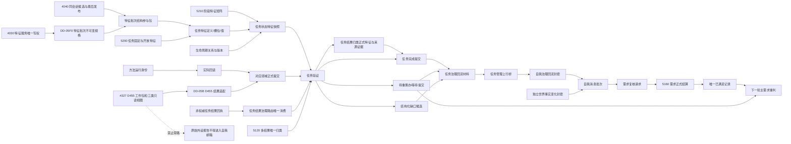

# DD-05 领域提交、任务验证与自我回流函数结构清单与知识图谱

日期：2026-07-21

状态：DD-05 P3—P4 现行设计记录；不授权代码实施

## 1. 依据与范围

本记录绑定：

- `规范/详细设计/领域提交任务验证与自我回流详细设计.md`
- `流程图/20260721_DD05_领域提交任务验证与自我回流流程图_v0.1.md`
- 3200、4010、4030、4040、4050、4110、4140、4160、5120、5160、5200、5210、5230、6350、8100、8200、8210 正式规范

以上是本函数 / 结构记录的直接施工依据摘要；完整正式依据和相邻边界以绑定详细设计第 2 节为准。本记录不裁剪、替代或扩写正式规范。

范围分为 DD-05F0、DD-05F、DD-05A、DD-05B。函数名是施工目标或当前复用点，不替代正式规范；实际签名必须由执行前 S0 复核。

## 2. 当前函数图

```text
任务工作线程::取出一条任务结果回执
├─ 任务结果治理路由::处理工作线程一条回执
│  └─ 任务结果治理路由::处理显式回执
│     └─ 任务结果结算组合器::处理任务执行结果
│        ├─ 任务业务服务::读取任务
│        ├─ 需求业务服务::读取需求
│        ├─ 方法业务服务::读取登记项 / 读取规格组
│        ├─ 任务业务服务::迁移生命周期
│        ├─ 任务业务服务::提交实际结果并完成
│        └─ 需求业务服务::提交独立结算
└─ 任务管理上行桥::处理下一条上行
   └─ 再次调用 任务工作线程::取出一条任务结果回执
      └─ 原始回执直接转换为自我治理消息
```

当前问题是双消费者和任务域直接触发需求结算；任务状态读取还只以生命周期投影为主。

## 3. DD-05F0 结构与函数清单

| 结构 / 函数 | 用途 | 权限与边界 |
| --- | --- | --- |
| `特征批次初始项规格` | 为一个候选宿主定义一项初始特征槽和值 | 由特征业务服务形成不可变规格；同层数据操作只能消费 |
| `特征批次换代项规格` | 固定既有槽、预期当前关系 / 值 / 版本和新值 | 不原地覆盖旧值；版本漂移在第一写前拒绝 |
| `特征批次变更规格` | 绑定批次幂等身份、规则版本、确定顺序和完整载荷 | 支持多槽初始、多槽换代及二者混合；摘要不替代逐项语义比较 |
| `特征批次结构参与包` | 把已验证特征候选加入具名同层数据操作的现行不透明写会话 | 不暴露仓库、执行器、会话、令牌或参与者；核心执行器零修改 |
| `特征业务服务::形成特征批次变更规格` | 统一校验定义、值域、来源、预期当前性和幂等语义 | 特征服务保持唯一公开业务写入权 |
| `特征体系数据操作::形成特征批次结构参与包` | 形成多槽、新值、旧当前失效和新当前候选 | 只供同层数据操作加入同一会话；普通读取在发布前只见旧完整状态 |
| `特征体系数据操作::读取特征批次结果` | 发布后按批次和宿主权威读回全部当前值 | 缺项、双当前或版本不闭合均为结构不完整 / 内部错误 |

现有 `特征值原始材料事务参与者` 已支持多项材料，DD-05F0 默认只读复用；只有 S0 证明其无法封装批次，才退回设计决定是否扩表。

## 4. DD-05F 结构清单

| 结构 | 用途 | 写入方 | 读取方 | 生命周期 |
| --- | --- | --- | --- | --- |
| `任务固定特征目录项` | 固定特征类型到正式特征定义、值域、来源和阶段规则的稳定映射 | 任务领域初始化 | 任务服务、数据操作、自检 | 运行期稳定；规则版本变更形成新版本 |
| `任务特征值材料` | 一项任务特征的宿主、定义、槽位、当前值、来源、版本和当前性 | 任务数据操作层 | 任务服务和高级只读组合器 | 每次异义变化形成新值，旧值历史保留 |
| `任务状态特征快照` | 当前任务锚点、生命周期和全部当前特征的值式投影 | 数据操作层组装 | 任务服务、筹办、执行、结果治理 | 随生命周期 / 特征版本变化失效 |
| `任务状态段材料` | `当前业务状态段`、`状态段当前性`两个固定特征及其定义、槽位、值、来源和版本的值式投影 | 任务数据操作层组装 | 任务调度、结果治理 | 随对应固定特征版本变化失效；不形成第二套状态权威 |
| `任务状态迁移请求` | 预期当前版本、目标阶段、目标状态段、特征增删改和证据 | 调用方形成，任务域准入 | 任务服务 | 单次请求材料 |
| `任务状态迁移写入规格` | 已验证并可在同一结构会话执行的不可伪造规格 | 任务服务 | 任务数据操作层 | 单次候选写入 |

## 5. DD-05F 函数清单

| 函数 | 当前 / 新目标 | 核心合同 |
| --- | --- | --- |
| `需求任务方法数据操作::读取任务` | 当前窄扩展 | 除结构锚点和生命周期外，返回完整当前特征快照；缺项不以阶段兜底 |
| `需求任务方法数据操作::读取任务状态特征快照` | 新目标 | 按任务稳定身份读取特征槽位、值、来源、版本和状态段 |
| `需求任务方法数据操作::形成任务状态迁移写入规格` | 新目标 | 验证预期当前关系 / 版本和 5210 目标矩阵，形成不可伪造规格 |
| `需求任务方法数据操作::提交任务状态迁移` | 新目标 | 同会话写候选、完整读回、最后发布；旧特征保留历史 |
| `需求任务方法数据操作::创建任务并发布初始状态` | 新目标 | 任务、初始生命周期、初始固定特征、状态段和来源证据共同确认并最后发布；不得暴露裸任务 |
| `任务业务服务::创建任务` | 当前收束 | 形成完整初始规格并调用共同发布入口；不得另设“初始化固定特征”补写步骤 |
| `任务业务服务::提交任务状态迁移` | 新目标 | 唯一解释阶段、状态段和特征集合联合迁移 |
| `任务业务服务::复核阶段与特征集合` | 新目标 | 机械执行 5210 必需 / 可选 / 禁止矩阵 |
| `任务业务服务::迁移生命周期` | 当前待收口 | 不再接受阶段单独裁决；兼容调用必须补齐完整特征变化或拒绝 |

## 6. DD-05A 结构清单

| 结构 | 用途 | 权威性 |
| --- | --- | --- |
| `任务结果回执` | 工作线程产生的执行材料 | 非权威；只作唯一治理入口输入 |
| `任务结果归类事实组` | 每项方法结果的唯一四类归属、来源方法、动作动态、输出场景、规则版本和当前性 | `执行结果类型`、`附带结果路由状态`、`禁止结果状态`等正式任务特征及来源证据的值式读回；与任务迁移共同发布 |
| `任务治理回流材料` | 任务提交后供上行的唯一强类型材料 | 引用权威任务、状态、动态和版本；自身不是业务事实 |
| `世界事实变化触发材料` | 独立世界事实的稳定身份、版本、来源领域、状态 / 动态证据、时间、当前性、去重键和过期条件 | 独立封套；不得伪造任务、需求、方法或执行轮次 |
| `派生需求目标组` | 目标对象、特征、状态和合同版本 | 非权威候选材料 |
| `派生需求当前偏差组` | 当前状态、结构化偏差、提交等级和当前性 | 非权威候选材料 |
| `派生需求来源证据组` | 任务、方法、动作运行、动态和结果轮次 | 非权威候选材料 |
| `自我治理回流封套` | 消息身份、去重键、引用、版本、时间和过期条件 | 队列材料；不裁决任务、需求或世界事实 |
| `需求复核请求` | 来源需求、任务结果、实际状态和证据 | 需求域正式入口材料 |

## 7. DD-05A 函数清单

| 函数 | 当前 / 目标 | 核心合同 |
| --- | --- | --- |
| `任务结果治理路由::处理工作线程一条回执` | 保留并加强 | 原始回执队列唯一消费入口 |
| `任务结果治理路由::处理显式回执` | 保留并加强 | 所有同步调用走同一协议和组合器 |
| `任务结果结算组合器::处理任务执行结果` | 窄改 | 权威重读、结果归类、任务验证和任务提交；不直接提交需求结算 |
| `任务业务服务::提交任务结果归类事实组` | 新目标 / 可并入状态迁移 | 每项四类归属由正式任务特征和来源证据共同发布；消息层不得重新分类 |
| `任务业务服务::提交任务状态迁移` | 消费 DD-05F | 提交待重筹办、等待、完成或终止的完整特征集合 |
| `任务业务服务::提交实际结果并完成` | 窄改 / 可并入上项 | 必须同时提交完成特征、结果关系和完整读回 |
| `需求业务服务::复核需求满足` | 新目标 | 使用正式特征值 / 状态判断收束，不直接比较裸 I64 |
| `需求业务服务::提交独立结算` | 保留 | 只接收已满足复核和完整证据，发布唯一结算记录 |
| `任务管理上行桥::处理已治理结果` | 替换旧入口 | 只消费 `任务治理回流材料`；不得访问任务工作线程 |
| `复核自我治理消息` | 窄改 | 拒绝原始外设报告、未治理回执和纯线程状态 |
| `自我治理领域路由::处理固定安全根需求` | 兼容收口 | 不再自动创建方法首 / 动作入口 / 方法选择，只消费正式材料 |

## 8. DD-05B 假定结构与函数

DD-05B 的精确名称必须等 #327 进入 main 后复核；当前只冻结职责：

| 结构 / 函数 | 职责 |
| --- | --- |
| `D455任务结果适配请求` | 绑定工作包、方法运行、材料视图、动作入口和当前性 |
| `D455任务结果适配结果` | 返回已发布实际状态 / 动态、事实提交等级、任务治理权威读回和工作包结束原因 |
| `适配D455稳定观察结果` | 空观察和确认观察分开，不补造存在 |
| `适配D455扫描变化结果` | 形成前后可比较状态、动态和残差 |
| `适配D455目标跟踪结果` | 当前坐标、暂失和丢失保持强类型分离 |
| `结束D455任务外设方法工作包` | 工作包和材料消费恰一次具名结束 |

## 9. 知识图谱



## 10. 所有权与依赖图

```text
#329 / DD-05F0
-> 独占特征数据操作、特征服务和两份特征自检
-> 无业务前置，先形成批次当前值换代与同会话参与合同

#330 / DD-05F
-> 依赖 #329 进入 main 和实际接口复核
-> 覆盖任务创建、迁移、完成、组合、装配及现行调用自检
-> 与 #328 文件重叠，因此 #328 必须后置并按实际接口修订

#331 / DD-05A
-> 依赖 #330 进入 main 和实际接口复核
-> 独占通用回执、结果治理、需求复核、上行桥和自我协议文件

#332 / DD-05B
-> 依赖 #327 和 #331 进入 main
-> 只拥有 D455 结果适配与专属自检

#328 / TASK-PREP-RIGHT
-> 依赖 #330 的完整任务特征快照和迁移入口
```

## 11. 验证边

```text
特征批次 -> 多槽初始、多槽换代、混合批次、发布前旧完整 / 发布后新完整、撤销失败隔离
任务特征快照 -> 十阶段矩阵、同阶段异义、缺项拒绝、旧版本审计
任务结果治理 -> 唯一队列消费者、四类结果、当前性、任务提交读回
上行封套 -> 同义去重、异义冲突、过期拒绝、无外设旁路
需求复核 -> 已满足唯一发布、未满足零记录、不可比较具名返回
D455 适配 -> 三类唯一映射、质量降级、暂失/丢失、工作包恰一次结束
```

本记录不证明代码已经修改、构建通过、计划已经派发或生产闭环已经接通。
