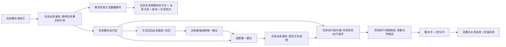

# 任务级唯一筹办执行权函数结构清单与知识图谱

日期：2026-07-21

角色：设计窗口

状态：设计链已完成；#328 / DQ-220 待执行；未派发、未建 worktree、代码未实现

## 1. 范围与一致性

依据：

- `规范/详细设计/任务级唯一筹办执行权详细设计.md`
- `流程图/20260721_任务级唯一筹办执行权流程图_v0.1.md`
- 0050、3200、5210、5230、5250、3300、5300 正式规范
- 当前任务生命周期、方法召回、选择提交、任务冻结和调度路由代码事实

范围一致性：正式规范、详细设计、MD / HTML 流程图、本文和 #328 施工计划共同限定为“任务结构原子取得权、召回前拒绝、选择来源绑定、冻结前同权复核、排队迁移失效、同任务排他和不同任务并发”。全部材料均排除完整任务状态特征存储、六类筹办闭合结果、D455 工作包、生产连续调度和真实外设。

## 2. 结构清单

### 2.1 复用结构

| 结构 | 当前所有者 | 用途 | 当前事实 |
| --- | --- | --- | --- |
| `任务权威材料` | `数据操作.需求任务方法` | 读取任务身份、当前生命周期和选择 | 已实现；没有显式筹办权投影 |
| `任务生命周期材料` | 同上 | 提供状态节点、关系、阶段、版本、时间和当前性 | 已实现 |
| `任务生命周期历史` | 同上 | 计算可追溯筹办轮次 | 已实现读取入口 |
| `任务提交结果` | 同上 | 区分 `已提交`、`幂等读回` 等 | 已实现；`成功()` 合并两类状态 |
| `任务方法选择材料` | 同上 | 绑定来源任务生命周期和方法生命周期 | 已实现；缺筹办轮次显式绑定 |
| `任务执行调度请求` | `线程.协议.任务执行请求` | 冻结和排队请求 | 已实现；缺执行权快照 |

### 2.2 新增值式结构

| 结构 | 唯一所有者 | 字段 / 责任 | 生命周期 |
| --- | --- | --- | --- |
| `任务筹办执行权状态` | `数据操作.需求任务方法` | 已取得、并发拒绝、入口拒绝、当前性漂移、许可拒绝、版本漂移、内部不一致 | 单次调用 |
| `任务筹办执行权` | 同上 | 任务、状态节点、占用关系、生命周期版本、筹办轮次、触发材料和时间 | 当前筹办关系有效期间 |
| `任务筹办执行权结果` | 同上 | 状态、权值和权威任务读回 | 单次调用 |
| `取得任务筹办执行权请求` | `服务.任务` | 任务、触发幂等材料、发生时间 | 单次调用 |
| 任务执行权传输字段 | `线程.协议.任务执行请求` | 复制权值字段供冻结复核，不裁决权威 | 单次调度 / 冻结快照 |

不新增节点类型、关系类型、进程局部占用表、线程身份、数据库锁或日志状态。

## 3. 函数清单

| 函数候选 | 所有者 | 输入 | 输出 | 前置返回 | 内部错误 |
| --- | --- | --- | --- | --- | --- |
| `读取任务筹办轮次` | 数据操作 | 任务及生命周期历史 | 单调轮次 | 无有效任务 | 历史双当前、轮次倒退 |
| `任务筹办执行权匹配` | 数据操作 | 当前任务、权值 | bool / 强类型状态 | 旧权、错任务 | 同一当前结构对应异义权值 |
| `取得任务筹办执行权` | 任务服务 | 取得请求 | 执行权结果 | 错阶段、已有占用 | 精确已提交后读回不一致 |
| `复核任务筹办执行权` | 任务服务 | 权值、可选预期选择 | 执行权状态 | 失效 / 漂移 | 双当前占用 |
| `方法召回业务服务::召回` 收窄 | 方法召回服务 | 召回请求 + 权值 | 候选结果 | 无权时候选读取前拒绝 | 同任务双权通过 |
| `适配唯一建议` 收窄 | 方法召回服务 | 召回结果 + 权值 | 选择请求 | 权失效 / 建议不唯一 | 召回权与选择权不一致 |
| `提交方法选择` 收窄 | 任务服务 / 数据操作 | 选择请求 + 轮次 | 任务提交结果 | 当前性变化 | 错权选择提交成功 |
| `召回并提交唯一选择` 收窄 | 需求任务方法组合器 | 取得权请求、召回材料、选择幂等材料 | 召回、选择、执行权 | 未取得权时直接返回 | 未取得权仍调用召回 |
| `冻结任务执行请求` 收窄 | 任务执行组合器 | 调度请求 + 权值快照 | 执行冻结 | 权失效、选择漂移 | 错权冻结成功 |
| `提交任务执行请求` 收窄 | 调度路由 | 调度请求 | 队列 / 排队结果 | 冻结拒绝、队列拒绝 | 确认后占用未失效 |

## 4. 调用图



## 5. 并发与状态图

```text
已承接 / 待重筹办
-> 原子取得成功
-> 筹办权已取得
-> 召回 / 选择 / 冻结
-> 排队中
-> 原执行权失效

同任务其它路径
-> 并发拒绝
-> 不进入召回

不同任务
-> 分别取得权
-> 可并发召回、选择和冻结
```

## 6. 验收映射

| 编号 | 验收 | 证据位置 |
| --- | --- | --- |
| TPR-A01 | 精确 `已提交` 才取得权 | 任务服务自检 |
| TPR-A02 | `幂等读回` 不授予权 | 任务服务自检 |
| TPR-A03 | 同任务 50 路 1/49 | 需求任务方法分层自检 |
| TPR-A04 | 49 路候选为空 | 方法召回自检 |
| TPR-A05 | 不同任务并发 | 需求任务方法分层自检 |
| TPR-A06 | 同根不同任务并发 | 需求任务方法分层自检 |
| TPR-A07 | 同方法不同任务并发 | 需求任务方法分层自检 |
| TPR-A08 | 旧轮次权值拒绝 | 生命周期 / 召回自检 |
| TPR-A09 | 错权选择拒绝 | 选择自检 |
| TPR-A10 | 错权冻结拒绝 | 调度自检 |
| TPR-A11 | 排队迁移使权值失效 | 调度自检 |
| TPR-A12 | 双路径越过召回门归为内部不一致 | 故障夹具 |

## 7. 与 #324 的并行隔离

```text
#324 所有权：D455 产品协议、自检、vcxproj、filters、入口最小登记
#328 所有权：既有任务域、方法召回、任务冻结、调度路由和相关既有自检
允许文件交集：0
结构 / 接口所有权交集：0
共享工程 / 入口唯一所有者：#324
固定集成顺序候选：#324 -> #328
```

当前尚未冻结共同基线、登记批次、创建 worktree 或派发任务，因此只能称为并行候选。
