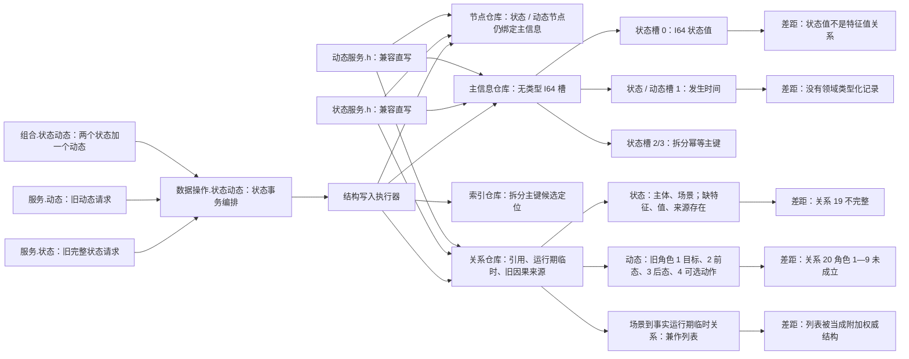
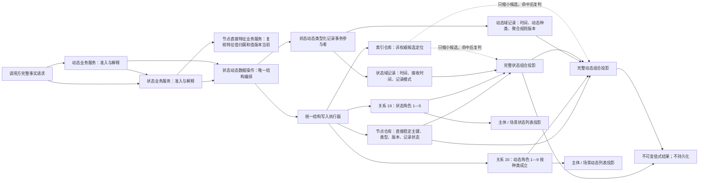
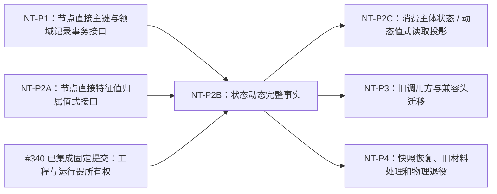

# NODE-TYPED-MIGRATION NT-P2B 函数结构知识图谱

日期：2026-07-22

基线：`main@1185e1b458b9c83244cd775dea3825931a134787`

身份：NT-P2B 设计记录；记录当前代码事实、目标结构、函数职责、正式关系映射和文件所有权，不是正式规范或代码实施许可

## 1. 图谱入口

```text
正式规范 -> 详细设计 -> 现状 / 施工流程图 -> 本函数结构图谱 -> 后继叶子施工计划
```

绑定：

- `规范/详细设计/NODE-TYPED-MIGRATION_NT-P2B_状态动态完整事实类型化迁移详细设计.md`
- `流程图/20260722_NODE-TYPED-MIGRATION_NT-P2B_状态动态完整事实迁移现状流程图_v0.1.md`
- `流程图/20260722_NODE-TYPED-MIGRATION_NT-P2B_状态动态完整事实迁移施工流程图_v0.1.md`

## 2. 当前结构图谱



## 3. 目标结构图谱



## 4. 当前函数事实表

| 当前函数 / 类型 | 文件 | 当前输入或作用 | 当前结构职责 | 迁移裁决 |
| --- | --- | --- | --- | --- |
| `创建实例状态请求` | `服务.状态.ixx` | 主键、场景、主体、时间、I64 值 | 旧状态业务准入 | 新增完整请求；旧请求不得静默适配 |
| `创建实例动态请求` | `服务.动态.ixx` | 主键、前后状态、目标、可选动作 | 旧动态业务准入 | 新增动态种类、来源存在、低层与同源角色 |
| `形成实例状态写入规格` | `数据操作.状态动态.ixx` | 旧状态请求 | 形成仍含 I64 值的规格 | 改为关系 19 和状态记录规格 |
| `写入实例状态_会话` | 同上 | 会话、旧状态规格 | 创建主信息、状态节点、索引和三条旧关系 | 保留事务骨架；改写节点、关系 19、记录、索引共同候选 |
| `读取实例状态_已许可` | 同上 | 主键或句柄、读取许可 | 组合节点、主信息槽和旧关系 | 改为完整状态事实读回 |
| `写入实例动态_会话` | 同上 | 会话、旧动态规格 | 创建主信息、动态节点、旧关系角色 | 保留事务骨架；改写节点、关系 20、记录、索引共同候选 |
| `读取实例动态_已许可` | 同上 | 主键或句柄、读取许可 | 组合动态、主信息时间和前后状态 | 改为完整动态事实读回 |
| 状态动态组合写入 | `组合.状态动态.ixx` | 两个状态和一个动态 | 同一会话共同发布或逆序撤销 | 保留组合事务职责；输入改为完整事实规格 |
| 结构写入执行器 | 核心模块 | 一个或多个事务参与者 | 取得唯一写入权、确认、发布、撤销 | 只读消费 NT-P1 发布接口，不在 P2B 重写 |
| `状态服务.h` 兼容入口 | `状态服务.h` | 旧状态参数 | 直接写主信息、节点、关系仓库 | P3 迁移与退役，P2B 禁止修改 |
| `动态服务.h` 兼容入口 | `动态服务.h` | 旧动态参数 | 直接逐项写旧仓库 | P3 迁移与退役，P2B 禁止修改 |
| 状态动态分层自检 | `自检.状态动态分层.ixx` | 旧路径验收 | 验证旧槽、旧关系、幂等和撤销 | 保留组织方式；验收对象改为完整事实 |

## 5. 状态域与动态域记录结构

### 5.1 状态域记录

| 字段 | 机器语义 | 约束 |
| --- | --- | --- |
| `所属状态` | 状态节点完整句柄 | 本事务候选或当前有效状态 |
| `格式版本` | 记录格式 ABI | 初版 1，未知版本拒绝 |
| `记录版本` | 本状态记录版本 | 初始 1，零值拒绝，不静默覆写 |
| `记录状态` | 4010 记录状态 ABI | 新事实为有效 |
| `发生时间` | 状态事实发生时间 | 非零 |
| `接收时间` | 可选接收时间 | 存在时不早于发生时间；缺失不以 0 冒充 |
| `记录模式` | 状态域强类型枚举 | 未登记模式拒绝 |

状态记录不得保存主体、场景、特征、值、来源存在等关系端点，也不得保存主信息句柄、拆分主键、通用槽位、显示名或日志文本。

### 5.2 动态域记录

| 字段 | 机器语义 | 约束 |
| --- | --- | --- |
| `所属动态` | 动态节点完整句柄 | 本事务候选或当前有效动态 |
| `格式版本` | 记录格式 ABI | 初版 1，未知版本拒绝 |
| `记录版本` | 本动态记录版本 | 初始 1，零值拒绝 |
| `记录状态` | 4010 记录状态 ABI | 新事实为有效 |
| `发生时间` | 动态发生时间 | 与后状态发生时间一致 |
| `动态种类` | 动态域强类型枚举 | 状态迁移动能、动作致变、观察 / 外部、聚合等登记种类 |
| `聚合规则版本` | 聚合算法口径 | 原子动态为 0；聚合动态非零 |

动态记录不得保存主体、场景、目标、前后状态、来源动作、来源低层动态、同源迁移动能或来源存在等关系端点。

两类记录身份均为：

```text
所属节点完整句柄 + 领域记录类型 + 记录版本
```

## 6. 关系 19 状态事实角色映射

| 顺序号 | 角色 | 源 | 目标 | 基数 | 读取用途 |
| --- | --- | --- | --- | --- | --- |
| 1 | 主体 | 状态 | 存在 | 恰一 | 主体状态投影与主体一致性 |
| 2 | 场景 | 状态 | 场景 | 恰一 | 场景状态投影与场景一致性 |
| 3 | 特征 | 状态 | 特征 | 恰一 | 状态语义与当前状态选择 |
| 4 | 值 | 状态 | 特征值 | 恰一 | 状态值身份；原始值由 P2A 记录承载 |
| 5 | 来源存在 | 状态 | 存在 | 恰一 | 事实来源身份 |

关系 19 的反向索引只用于形成候选列表；完整读取仍须逐项回读五个角色、节点和状态域记录。

## 7. 关系 20 动态事实角色映射

| 顺序号 | 角色 | 源 | 目标 | 基数 | 适用种类 |
| --- | --- | --- | --- | --- | --- |
| 1 | 主体 | 动态 | 存在 | 恰一 | 全部 |
| 2 | 场景 | 动态 | 场景 | 恰一 | 全部 |
| 3 | 被改变目标 | 动态 | 特征或特征值 | 恰一 | 全部 |
| 4 | 前状态 | 动态 | 状态 | 恰一 | 全部 |
| 5 | 后状态 | 动态 | 状态 | 恰一 | 全部 |
| 6 | 来源动作 | 动态 | 方法 | 动作致变恰一；其它为零 | 动作致变 |
| 7 | 来源低层动态 | 动态 | 动态 | 原子为零；聚合至少一项，可多项 | 聚合 |
| 8 | 同源状态迁移动能 | 动态 | 动态 | 动作致变恰一；其它为零 | 动作致变 |
| 9 | 来源存在 | 动态 | 存在 | 恰一 | 全部 |

动作致变动态必须同时具备角色 6 和 8。普通状态迁移动能、观察动态和外部事件动态的角色 6 必须为零；不得伪造方法作为来源动作。

## 8. 目标函数职责图

```text
特征业务服务
  -> 复核特征值归属
  -> 只返回特征、特征值、归属和值版本当前性的值式结果

状态业务服务
  -> 形成完整实例状态写入规格
  -> 创建完整状态事实
  -> 读取完整状态事实
  -> 读取主体状态事实组
  -> 解释入口拒绝、幂等和完整投影

动态业务服务
  -> 形成完整实例动态写入规格
  -> 记录状态迁移动能
  -> 记录动作致变动态
  -> 记录聚合动态
  -> 读取完整动态事实
  -> 读取主体动态事实组

状态动态数据操作
  -> 写入完整状态事实_会话
  -> 写入完整动态事实_会话
  -> 读取完整状态事实_已许可
  -> 读取完整动态事实_已许可

状态动态类型化记录事务参与者
  -> 登记状态记录
  -> 登记动态记录
  -> 准备提交
  -> 确认待发布
  -> 完成发布
  -> 完成撤销

状态动态类型化记录访问器
  -> 读取状态记录
  -> 读取动态记录
```

## 9. 函数调用链

### 9.1 创建完整状态事实

```text
状态服务公开入口
-> 形成完整实例状态写入规格
   -> 复核主体、场景、特征、值、来源存在和时间
   -> 节点直接特征业务服务::复核特征值归属
-> 状态动态数据操作按稳定主键预读
-> 同键同义：返回原完整投影
-> 同键异义：写前冲突
-> 未找到：结构写入执行器取得唯一写入权
-> 写入完整状态事实_会话
   -> 创建直接稳定主键状态节点候选
   -> 登记状态域记录
   -> 创建关系 19 角色 1—5
   -> 绑定状态命名域索引候选
   -> 同会话完整读回
-> 全部参与者确认待发布
-> 最后无失败发布
-> 事务外读取完整状态事实
-> 返回不可变组合投影
```

### 9.2 创建完整动态事实

```text
动态服务公开入口
-> 经状态服务读取前后完整状态投影
-> 形成完整实例动态写入规格
   -> 复核同主体、同场景、目标、时间、来源存在
   -> 按动态种类复核角色 6—8
-> 状态动态数据操作按稳定主键预读
-> 同键同义 / 同键异义收口
-> 结构写入执行器取得唯一写入权
-> 写入完整动态事实_会话
   -> 再读前后状态当前性和关系 19 完整性
   -> 创建直接稳定主键动态节点候选
   -> 登记动态域记录
   -> 创建关系 20 基础角色与种类角色
   -> 绑定动态命名域索引候选
   -> 同会话完整读回
-> 全部参与者确认并最后发布
-> 事务外读取完整动态事实和前后状态投影
```

### 9.3 状态形成迁移动能

```text
完整后状态发布
-> 按主体、特征、场景和时间读取相邻前状态
-> 无相邻前状态：返回“基准状态已发布、未形成动态”
-> 有相邻前状态：形成状态迁移动能
-> 同时存在合法方法动作：另形成动作致变动态
-> 动作致变动态通过关系 20 角色 8 引用同源状态迁移动能
```

## 10. 读取与列表投影图

```text
完整状态投影
  索引候选
  -> 状态节点直接身份
  -> 关系 19 角色 1—5
  -> 状态域记录
  -> 特征服务复核角色 3/4
  -> 不可变值式材料

完整动态投影
  索引候选
  -> 动态节点直接身份
  -> 关系 20 角色组合
  -> 经状态服务读取角色 4/5 完整状态
  -> 动态域记录
  -> 种类、时间、来源和同源证据复核
  -> 不可变值式材料

列表投影
  关系 19 角色 1/2 反向索引 -> 主体 / 场景状态候选
  关系 20 角色 1/2 反向索引 -> 主体 / 场景动态候选
  -> 逐项完整读回
  -> 可丢弃、可重建、不持久化

P2C 自我读取入口
  状态业务服务::读取主体状态事实组(节点句柄 主体)
  动态业务服务::读取主体动态事实组(节点句柄 主体)
  -> 只返回调用期不可变值式结果组
  -> 不返回持久列表、仓库、索引、许可或事务能力
```

## 11. 非成功图谱

```text
逻辑内返回节点
  写前拒绝：身份、类型、版本、来源、时间或角色组合无效
  特征值归属拒绝：特征和值不相容或值版本非当前
  幂等读回：同键同义且节点、关系、记录全部互证
  幂等冲突：同键异义，零写入
  当前性漂移 / 许可竞争：第一笔写入前具名返回
  基准状态：状态已发布但没有相邻前状态，不创建动态

内部逻辑错误节点
  节点、关系、记录或索引创建后不及预期
  关系 19/20 缺失、重复、错端点或错种类组合
  类型化记录复制关系端点或出现未知版本
  参与者准备、确认、撤销或发布不闭合
  发布后完整读回不一致

内部错误边
  停止新增写入
  -> 统一可见点前精确逆序撤销
  -> 读回证明事务前态
  -> 无法证明则在释放写入权前隔离事务域
  -> 已发布异常停止依赖路径并保留证据
```

## 12. 文件所有权图

```text
P2B 隔离新域独占候选
  海中鱼巣/领域/状态动态类型化记录.数据.h
  海中鱼巣/领域/参与者.状态动态类型化记录.ixx
  海中鱼巣/领域/数据操作.节点直接状态动态.ixx
  海中鱼巣/领域/服务.节点直接状态.ixx
  海中鱼巣/领域/服务.节点直接动态.ixx
  海中鱼巣/领域/组合.节点直接状态动态.ixx
  海中鱼巣/领域/自检.节点直接状态动态.ixx

只读依赖
  NT-P1：节点直接身份、关系、索引、结构会话和记录参与接口
  P2A：节点直接特征业务服务::复核特征值归属
  现行默认状态动态数据操作 / 服务 / 组合 / 自检
  正式规范：1160、1170、4010、4020、4040、4210、4220

本叶子活动期共享接线唯一所有者
  海中鱼巣.vcxproj
  海中鱼巣.vcxproj.filters
  统一自检运行器
  -> #340 已集成且经设计接受后由 #341 接管；#341 集成并经设计接受后移交 #342；运行期装配和入口禁止修改

P2B 禁止
  特征体系数据操作、特征值记录参与者和 4170 批次账
  存在场景数据操作、自我内部世界和列表结构
  需求、任务、方法、任务执行和运行期业务路由
  状态服务.h、动态服务.h 兼容迁移
  快照恢复、旧快照处理和主信息仓库物理删除
```

## 13. 依赖图



依赖说明：

1. NT-P1 必须先发布节点直接稳定主键、类型化记录事务参与接口，以及节点、关系、记录、索引同事务能力；
2. P2A 必须由节点直接特征业务服务冻结 `复核特征值归属` 值式只读合同，P2B 不得读取特征值记录容器；
3. P2B 可以在上述接口冻结后独立实现新完整事实，但不能自行迁移旧业务调用方；
4. P2C 只消费 `读取主体状态事实组` / `读取主体动态事实组` 的值式结果，不取得 P2B 仓库或事务能力；
5. P3 才能为旧调用语境补齐显式特征、特征值、来源存在和动态种类，并关闭旧写入口；
6. P4 才能处理快照、恢复、历史旧代事实和主信息兼容结构的物理退役；
7. P2A、P2B、P2C 固定按 `#340 -> #341 -> #342` 串行；#341 只在 #340 已集成且经设计接受后接管工程与运行器，完成后再移交 #342，不另立共享接线叶子。

## 14. 代码漂移门禁

执行前必须重新扫描并比较本图谱。出现以下任一漂移，P2B 不开工：

1. `服务.节点直接状态.ixx` / `服务.节点直接动态.ixx` 不再是新域业务解释入口；
2. `数据操作.节点直接状态动态.ixx` 不再是新域结构编排唯一入口；
3. 关系 19/20 的角色、顺序、端点、基数或动态种类组合已变化；
4. NT-P1 没有发布节点直接主键或领域记录参与接口；
5. 节点直接特征业务服务没有发布值式 `复核特征值归属`，或要求 P2B 读取 P2A 记录容器；
6. P2A/P2C 已取得状态动态文件、工程文件或同一自检文件所有权；
7. 新实现需要主信息槽、关系端点副本、持久列表、旧新双写或旧产物静默回退；
8. 验证只能证明编译、日志、返回码、索引命中或旧关系计数，不能完整读回节点、关系和领域记录。

## 15. 图谱验证清单

- 当前事实节点均可回指 `main@1185e1b4` 代码；
- 目标结构均可回指 1160、1170、4010、4020、4030、4040、4050、4210、4220；
- 关系 19 角色 1—5 和关系 20 角色 1—9 与正式冻结合同一致；
- 每个拓扑端点只由正式关系承载，不在状态域或动态域记录复制；
- 状态值只引用特征值节点，原始值由 P2A 类型化记录承载；
- 列表和当前状态选择均为可重建投影；
- 逻辑内返回与内部逻辑错误没有互相降级；
- P2A 到 P2B 的特征值归属接口、P1 事务接口，以及 #340 已集成固定提交对工程 / 运行器所有权的移交，均作为 #341 派发前门禁；
- P2B、P3、P4 的迁移与退役职责未混写。
