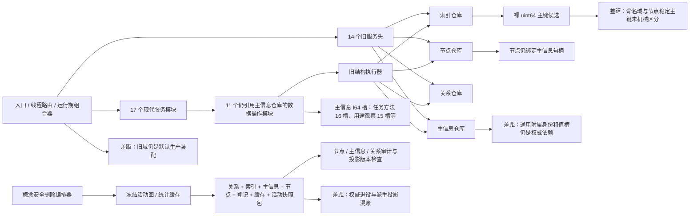
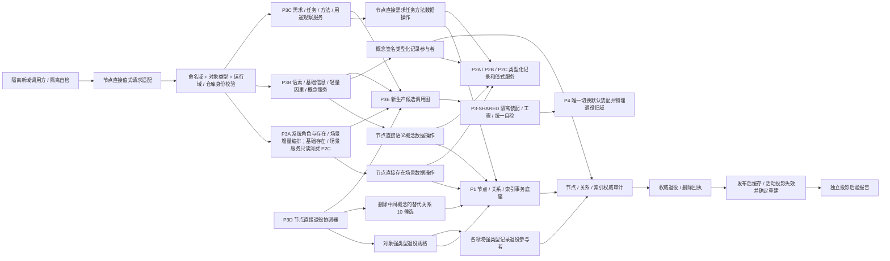
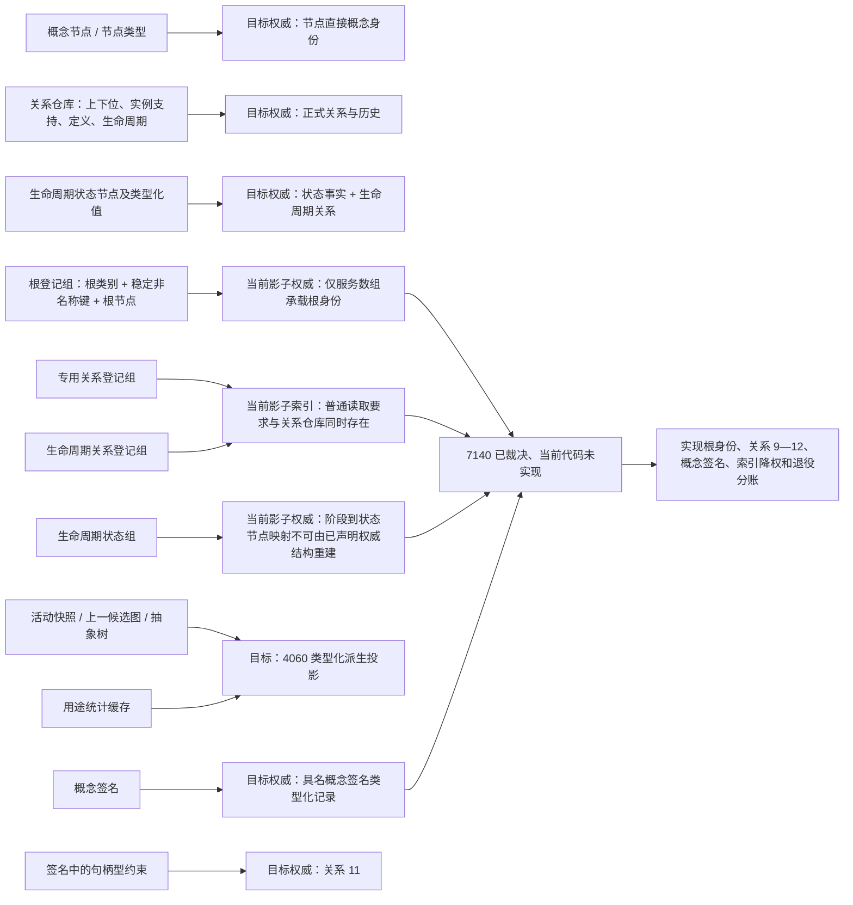
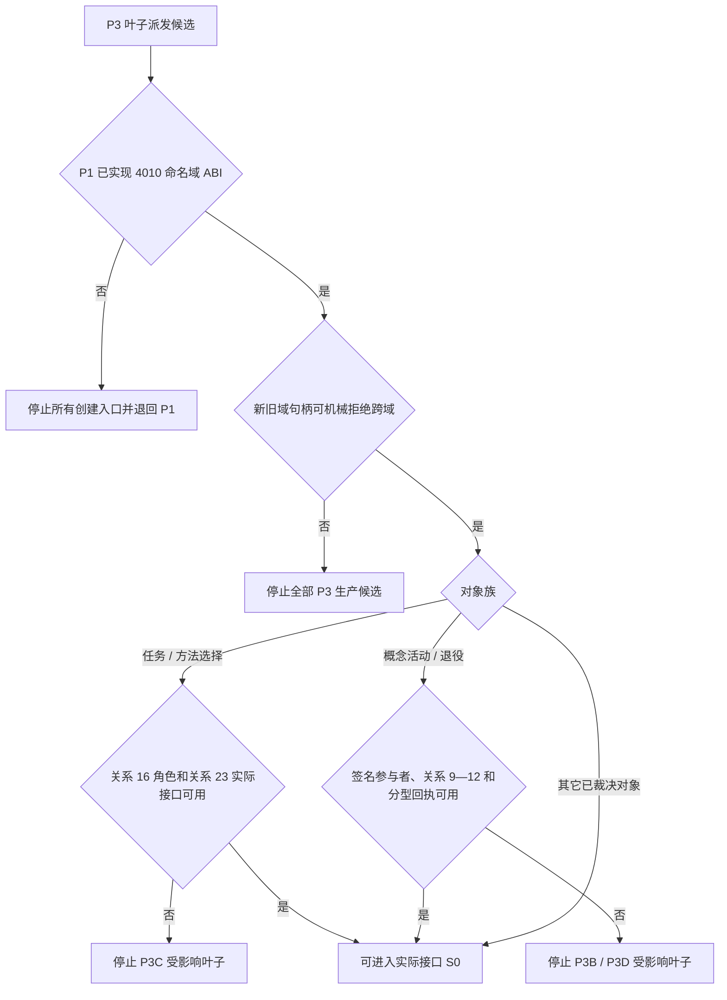

# NODE-TYPED-MIGRATION NT-P3 函数结构知识图谱

日期：2026-07-22

基线：`main@1185e1b458b9c83244cd775dea3825931a134787`

身份：NT-P3 设计记录；记录当前代码事实、目标函数职责、叶子所有权和 P4 交接边界，不是正式规范或代码许可

## 1. 图谱入口

```text
正式规范
-> NT-P1 / P2A / P2B / P2C 实际接口
-> NT-P3 现状 / 施工流程图
-> NT-P3 详细设计
-> 本函数结构知识图谱
-> NT-P3A—P3E / P3-SHARED 叶子施工计划
```

绑定：

- `流程图/20260722_NODE-TYPED-MIGRATION_NT-P3_服务兼容删除审计迁移现状流程图_v0.1.md`
- `流程图/20260722_NODE-TYPED-MIGRATION_NT-P3_服务兼容删除审计迁移施工流程图_v0.1.md`
- `规范/详细设计/NODE-TYPED-MIGRATION_NT-P3_服务兼容删除审计迁移详细设计.md`

## 2. 当前结构图谱



## 3. 目标结构图谱



## 4. 当前模块事实表

| 当前模块 / 类型 | 当前职责 | 迁移价值 | P3 裁决 |
| --- | --- | --- | --- |
| `服务.存在` / `服务.场景` | 值式存在和场景业务入口 | 保留业务解释和结果分类 | 映射到 P3A 新模块，不就地切换 |
| `数据操作.存在场景` | 创建 / 读取存在、场景和关系 | 保留专用编排思想 | 删除主信息创建，改用 P1 / P2C 新域接口 |
| `数据操作.系统角色` | 初始化根角色和关系 | 可提取角色创建职责 | 消费 4010 固定命名域 ABI，不得从旧数组推断 |
| `服务.语素` / `服务.基础信息` | 原子 / 聚合语义入口 | 保留服务分层 | 映射到 P3B |
| `数据操作.语素基础` | 创建语素和基础信息结构 | 保留编排，重新分账关系 / 记录 | 映射到 P3B |
| `服务.轻量因果` / `数据操作.轻量因果` | 形成和读取轻量因果引用 | 保留正式关系职责 | 不把引用升级为稳定因果结论 |
| `服务.概念图结构` / `数据操作.概念图结构` | 创建概念结构与登记 | 保留结构关系职责 | 消费 7140；登记数组降为投影，签名进入具名记录 |
| `服务.概念活动` / `数据操作.概念活动` | 生命周期状态和活动视图 | 保留值式生命周期读取 | 活动视图只作可重建投影 |
| `服务.需求` / `服务.任务` / `服务.方法` | 需求、任务、方法业务入口 | 保留业务前置和结果分类 | 映射到 P3C |
| `数据操作.需求任务方法` | 多对象事务编排 | 保留领域共同事务结构 | 删除 16 槽关系副本；实现关系 16 角色与关系 23 |
| `服务.用途观察` / `数据操作.用途观察` | 观察证据和阶段推进 | 保留 4330 业务语义 | 删除 15 槽无类型载荷，改具名记录 / 关系 |
| `服务.概念安全删除` | 冻结影响面、提交删除、后验复核 | 保留精确冻结和审计思路 | 由 P3D 重建，不能复用旧删除包 |
| `组合.运行期业务操作` | 汇合现代业务服务 | 可作为候选调用图证据 | P3E 新建隔离版本；现行文件 P4 才切换 |
| `组合.运行期只读查询` | 汇合现代只读服务 | 可作为候选读取图证据 | P3E 新建隔离版本 |
| `路由.运行期业务请求` | 请求分派 | 可提取值式请求边界 | P3E 只形成新域适配；默认路由 P4 才切换 |
| `装配.运行期业务` / `启动.运行期上下文` / `入口.cpp` | 默认旧域装配和启动 | 只作 P4 差距证据 | P3 禁止修改 |

## 5. 目标函数职责图

```text
节点直接值式请求适配
  -> 校验请求版本
  -> 校验对象类型和节点稳定主键命名域
  -> 校验新域句柄 / 仓库身份
  -> 形成具名业务请求
  -> 映射结构化业务结果

节点直接领域服务
  -> 解释业务规则、值域、权限和幂等身份
  -> 形成强类型写入 / 退役规格
  -> 调用唯一专用数据操作
  -> 返回值式结果

节点直接专用数据操作
  -> 事务外预读
  -> 第一写前锁内重读
  -> 编排 P1 结构参与者和 P2 记录参与者
  -> 完整读回
  -> 分类逻辑内结果与内部错误

节点直接退役协调器
  -> 冻结节点、全部关系、领域记录和索引候选
  -> 概念删除时登记概念签名参与者和替代关系 10
  -> 调用各领域强类型记录参与者
  -> 共同确认和无失败发布
  -> 读取权威审计
  -> 返回权威退役 / 删除回执
  -> 发布后触发投影 / 缓存失效和重建并形成独立后验报告

新生产候选调用图
  -> 登记逐调用点当前入口到目标入口映射
  -> 只由隔离装配 / 自检到达
  -> 为 P4 一次默认切换提供固定接口
```

## 5.1 `概念图服务.h` 当前分账审计



7140 / 4010 已闭合规则到代码的实现映射：

| 已冻结规则 | 唯一权威归属 | 现行结构的目标处置 |
| --- | --- | --- |
| 概念根身份 / 类别 / 稳定键 | 节点直接身份和四个固定根角色 | `根登记组_` 降为可重建索引 |
| 概念生命周期 | 关系 12 + 状态类型化记录 | `生命周期关系登记组_` 降为索引；缺索引可重建 |
| 阶段状态角色 | 三个固定抽象状态身份 | `生命周期状态组_` 降为索引 |
| 概念签名 | 具名概念签名类型化记录；句柄型约束进入关系 11 | 不再只随 `活动快照_` 保存 |
| 专用关系登记 | 关系仓库与关系历史 | `专用关系登记组_` 降为反向索引 / 诊断投影 |
| 活动节点、根组、签名组、关系组、抽象树 | 4060 类型化投影命名空间 | `活动快照_` / `上一候选图_` 可失效、清空、确定重建 |
| 用途统计 | 4060 非权威统计 | 发布后失效 / 重新积累，不参与删除裁决 |
| 概念退役 / 删除完成 | 节点、关系 9—12、具名记录和索引的权威审计 | 与投影失效 / 重建后验报告分离 |

## 6. 目标函数候选表

下列名称是设计候选，叶子开工时必须按实际 P1 / P2 接口 S0 冻结；不得解释为当前已存在。

| 候选函数 | 层 | 输入 | 输出 | 主要约束 |
| --- | --- | --- | --- | --- |
| `规范化节点直接请求` | P3E 适配 | 请求版本、对象类型、命名域、值式材料 | 具名请求或入口拒绝 | 不访问仓库，不猜测命名域 |
| `复核新域句柄身份` | P3E / 服务边界 | 完整句柄、目标域身份 | 值式校验结果 | 旧域 / 跨域必须机械拒绝 |
| `创建存在身份` | P2C 固定服务，P3A 只读消费 | 稳定主键、存在类型、必要关系材料 | 存在业务结果 | P3A 不回写 P2C；接口不足则退回原所有者 |
| `创建场景身份` | P2C 固定服务，P3A 只读消费 | 场景主键、宿主 / 成员规格 | 场景业务结果 | 成员只走关系，不保存数组；P3A 不复制算法 |
| `初始化系统角色` | P3A 服务 | 具名角色规格 | 系统角色结果 | 不读旧默认角色补项 |
| `创建语素身份` | P3B 服务 | 语素主键、语言与组成规格 | 语素业务结果 | 拓扑走关系，原始值走具名记录 |
| `创建基础信息身份` | P3B 服务 | 主键、信息关系规格 | 基础信息结果 | 原子 / 聚合分层 |
| `登记轻量因果引用` | P3B 服务 | 来源、目标、角色、证据 | 因果引用结果 | 单引用不是稳定因果结论 |
| `写入概念签名` | P3B 数据操作 | 概念句柄、非拓扑签名值、关系 11 角色 | 概念签名记录结果 | 记录不复制句柄型约束 |
| `创建概念结构` | P3B 服务 | 概念规格、签名、关系 9—12 | 概念业务结果 | 登记数组和活动快照不参与权威裁决 |
| `创建完整目标状态需求` | P3C 服务 | 需求、目标状态、主体 / 场景关系 | 需求结果 | 目标状态不退化为 I64 |
| `初始化任务承接` | P3C 服务 | 任务、来源需求、初始状态 | 任务结果 | 承接与筹办执行权分账 |
| `提交任务方法选择` | P3C 服务 | 任务、方法、选择证据 | 任务结果 | 实现关系 16 角色 30—34、40 和关系 23 互证 |
| `登记方法` | P3C 服务 | 方法规格、能力和条件关系 | 方法结果 | 执行授权来自任务关系 |
| `记录用途观察` | P3C 服务 | 因果 / 任务 / 方法证据和值式阶段材料 | 观察结果 | 4330 强类型账，不复制关系端点 |
| `读取主键对象` | 各专用数据操作 | 所有者 + 命名域 + 稳定主键 | 完整值式投影 | 索引命中后复判节点 / 关系 / 记录 |
| `形成对象退役规格` | 各对象服务 | 目标句柄、预期版本、业务前置 | 强类型退役规格 | 不形成通用记录容器 |
| `提交节点直接退役` | P3D | 强类型退役规格 | 权威退役回执 | 关系 / 记录 / 索引 / 节点共同事务 |
| `提交概念安全删除` | P3D | 概念删除规格、签名、关系 9—12 和外部关系 | 权威删除回执 | 新增 / 复用替代关系 10 与旧边失效同事务发布 |
| `复核节点直接退役审计` | P3D | 权威退役回执 | 审计结果 | 不以缓存或日志证明 |
| `重建派生投影` | 投影所有者 | 权威节点 / 关系 / 记录 | 投影后验报告 | 发布后执行，不参与权威完成 |

## 7. 核心调用链

### 7.1 创建 / 更新

```text
隔离调用方
-> 节点直接适配::规范化节点直接请求
-> 节点直接适配::复核新域句柄身份
-> 对象领域服务::形成强类型写入规格
-> 对象专用数据操作::事务外预读
-> 结构执行器::取得新域唯一写入权
-> 对象专用数据操作::第一写前锁内重读
-> P1 节点 / 关系 / 索引候选接口
-> P2 具名记录参与者
-> 对象专用数据操作::完整读回
-> 全部参与者确认待发布
-> 最后发布
-> 对象领域服务::返回值式结果
```

### 7.2 普通读取

```text
对象领域服务::读取主键对象
-> 请求适配提供所有者 + 命名域 + 稳定主键
-> 索引返回候选
-> P1 复核节点直接身份和关系
-> P2 值式服务读取所属领域记录
-> 对象专用数据操作组合调用期投影
-> 领域服务返回不可变结果
```

### 7.3 节点退役

```text
对象领域服务::形成对象退役规格
-> P3D::提交节点直接退役
-> 冻结节点 / 当前关系 / 领域记录 / 索引候选
-> 取得唯一写入权并锁内重读
-> 失效关系
-> 各领域记录参与者登记退役
-> 移除索引
-> 标记节点删除
-> 完整读回权威审计
-> 确认并最后发布
-> 投影所有者::使缓存 / 活动图失效并重建
-> P3D::返回分账回执
```

## 8. 权威结构节点表

| 图谱节点 | 身份 | 写入方 | 读取方 | 生命周期 |
| --- | --- | --- | --- | --- |
| 节点直接记录 | 节点编号 + 稳定主键 + 类型 + 版本 | P1 节点参与者 | 各节点直接数据操作 | 创建至退役，历史可审计 |
| 正式关系 | 完整关系句柄、类型、角色、顺序、版本 | P1 关系参与者 | 各领域服务 / 数据操作 | 有效、失效、删除历史 |
| 领域类型化记录 | 所属节点 + 具名记录类型 + 版本 | P2 / P3C 具名参与者 | 对象数据操作 | 随领域事实生命周期，历史保留 |
| 索引候选 | 所有者 + 命名域 + 稳定主键 | P1 索引参与者 | 候选定位 | 可清空重建，非权威 |
| 业务不可变账 | 具名业务身份和完整引用 | 对应账参与者 | 幂等 / 审计 / 恢复 | 发布后不可变 |
| 组合读取投影 | 一次调用值式结果 | 专用数据操作临时组合 | 领域服务调用方 | 调用期，不持久化 |
| 活动 / 统计投影 | 派生投影身份和版本 | 投影所有者 | 运行期读取 | 可失效、可确定重建 |

## 9. 关系边界表

| 源 | 边 | 目标 | 权威位置 | 禁止副本 |
| --- | --- | --- | --- | --- |
| 存在 / 场景 / 自我 | 成员、内部世界、归属 | 存在 / 场景节点 | 正式关系 | 成员数组、拓扑锚点 |
| 词 / 语素入口 / 基础信息 | 组成、语言、信息路由 | 语言对象节点 | 正式关系 | 通用附属字段 |
| 因果对象 | 来源 / 结果 / 证据角色 | 状态、动态、方法等 | 正式因果关系 | I64 句柄槽 |
| 需求 | 父子、主体、目标状态 | 需求 / 状态节点 | 正式关系 | 记录端点副本 |
| 任务 | 来源需求、承接、生命周期、方法选择 | 需求 / 状态 / 方法 | 待正式关系冻结 | 任务方法 16 槽 |
| 方法 | 条件、能力、结果、任务授权 | 状态 / 特征 / 任务 | 正式关系 | 方法规格无类型槽 |
| 用途观察 | 因果 / 任务 / 方法证据 | 各证据节点 | 正式关系 + 4330 具名记录 | 15 槽端点副本 |
| 退役节点 | 关系历史、记录历史 | 审计材料 | 原权威仓库历史 | 缓存 / 日志完成标志 |

## 10. 非成功图谱

```text
逻辑内返回
  请求版本 / 类型 / 命名域错误
  旧域或跨域句柄
  合法未找到 / 空组
  同键同义完整读回
  同键异义
  业务前置不足
  第一写前版本漂移
  未形成候选前许可竞争
  退役候选过期

内部逻辑错误
  前置通过后节点 / 关系 / 记录 / 索引候选不及预期
  完整读回不互证
  新旧域句柄被错误接受
  领域记录复制拓扑或回读旧主信息
  参与者阶段、确认、撤销或发布不闭合
  发布后权威审计不一致
  派生投影无法确定失效 / 重建

发布前内部错误
  停止新增写入 -> 逆序撤销 -> 证明前态 -> 失败则隔离事务域

发布后内部错误
  停止依赖路径 -> 保留权威审计 -> 追根因
```

## 11. 叶子所有权图

```text
NT-P3A
  只读消费 P2C 存在 / 场景值式接口
  系统角色数据操作 / 服务 / 组合和独立自检
  必要时新增存在场景扩展模块，不修改 P2C 文件

NT-P3B
  语素 / 基础信息 / 轻量因果 / 概念结构的新域服务、数据操作和独立自检

NT-P3C
  需求 / 任务 / 方法 / 用途观察的新域服务、数据操作、具名记录和独立自检

NT-P3D
  节点直接强类型退役协调、独立领域退役适配、审计和独立故障自检
  只读消费 P2A—P2C、P3A—P3C 固定退役接口，不回写上游文件

NT-P3E
  新域请求适配、业务组合器、只读组合器和逐调用点 P4 映射

NT-P3-SHARED
  隔离装配、海中鱼巣/自检.运行器.ixx 统一新域接线和工程登记终检
  工程 XML 与运行器专属自检登记所有权由 P3A -> P3B -> P3C -> P3D -> P3E -> P3-SHARED 串行移交

P4 唯一所有权
  入口.cpp
  旧默认装配 / 启动上下文
  旧生产调用方迁移
  十四份旧服务头和旧仓库物理删除
  统一快照恢复、旧材料策略和默认一次切换
```

## 12. 已闭合规范到实际接口的门控图



## 13. P4 交接映射

P3 固定提交交给 P4 的不是“已切换”事实，而是以下已验证材料：

| P3 输出 | P4 消费 |
| --- | --- |
| 新域服务和数据操作固定模块图 | 构造唯一新默认运行期上下文 |
| 新域值式请求适配 | 替换默认线程 / 组合器调用点 |
| 逐调用点映射 | 删除旧服务头与旧生产调用方前的覆盖证明 |
| 强类型退役和审计接口 | 快照 / 恢复与退役验收 |
| 新旧域零互查静态证据 | 最终一次切换门禁 |
| 隔离自检和故障矩阵 | P4 默认切换后的回归基线 |

P4 必须重新复核实际提交。P3 文档、计划或聊天回执不能替代固定 Git 事实。

## 14. 代码漂移门禁

执行前若出现以下任一漂移，受影响叶子停止：

1. 11 / 17 / 14 的当前命中集合或默认调用图发生变化；
2. P1 / P2 实际模块名、公开签名、事务阶段或值式读取边界改变；
3. P1 / P2 / P3 实际接口不能实现 4010、5210、5230、5300 或 7140 已冻结合同；
4. 新域服务必须修改现行默认模块才能构建；
5. 任何叶子需要主信息兼容双写、通用记录容器或旧域回退；
6. P3A—P3E 对同一文件、接口或自检发生所有权重叠；
7. 非当前串行登记所有者写工程 XML / 统一运行器，或业务叶修改非自身模块 / 专属自检登记；
8. 删除只能由日志、缓存、数量或 bool 证明；
9. P3 工作必须提前修改 P4 独占文件。

## 15. 图谱验证清单

- 当前节点均能回指 `main@1185e1b4` 的精确模块；
- 11 个数据操作、17 个现代服务和 14 个旧服务头分别计数，不互相混作白名单；
- 目标服务只依赖 P1 / P2 隔离新域接口；
- 请求适配零仓库、零令牌、零会话、零旧域回退；
- 每个正式拓扑只在关系中表达；
- 每个非拓扑领域值只进入具名强类型记录；
- 索引只缩小候选并在命中后复判；
- 权威退役与缓存 / 活动投影分账；
- 命名域、关系 16 / 23、概念签名和概念投影分账规则已经闭合，并分别形成实际接口硬门禁；
- P3A—P3E 与 P3-SHARED 所有权可机械隔离；
- 入口、默认装配、旧服务头和物理删除始终保留给 P4。
